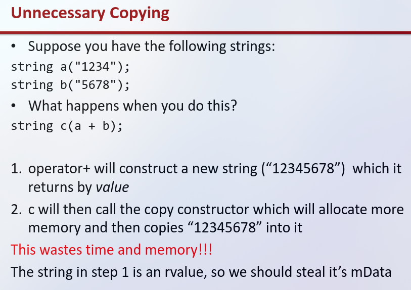
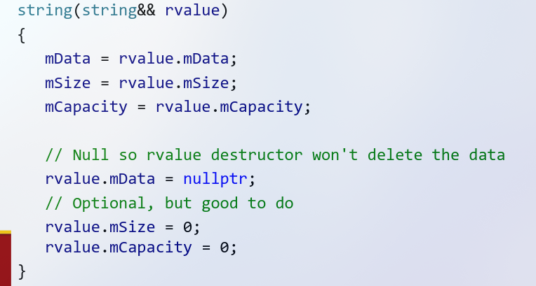

Move Semantics
---
Week 1, Lecture 2

* lvalue is a variable or object that persists beyond an expression
    * if you can take the address of a, it is most likely an lvalue.
```

int a = 5;
&a; //valid because a is an lvalue
&(a+1) // invalid because (a+1) is not an lvalue

int* p1 = &a;
&p1;
&(++p1); //valid, preincrements
&(p1++); //invalid, creates a copy


```






Rule of 5:
- Destructor (~T)
- Copy constructor (T(const T&))
- Copy assignment operator (T& operator=(const T&))
- Move constructor (T(T&&) noexcept)
- Move assignment operator (T& operator=(T&&) noexcept)


```cpp
//use std::move() when moving dynamic memory in a move constructor
int a = new int(5);
int b = std::move(a);
```
