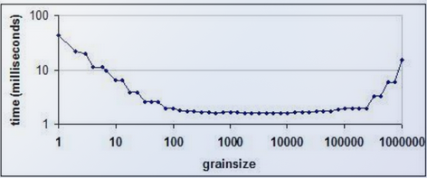
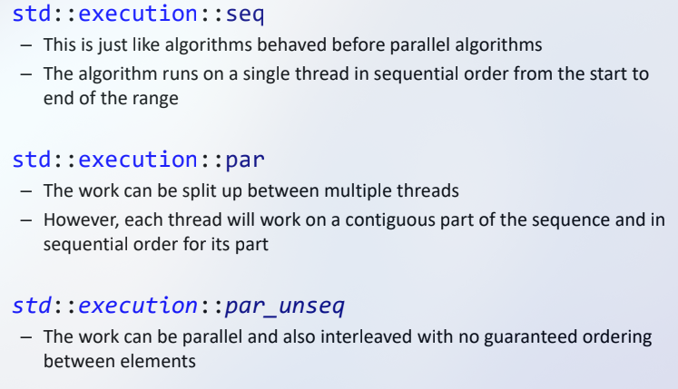
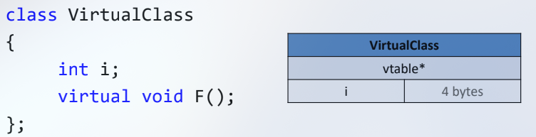
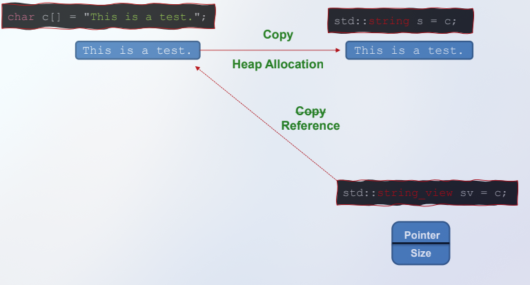
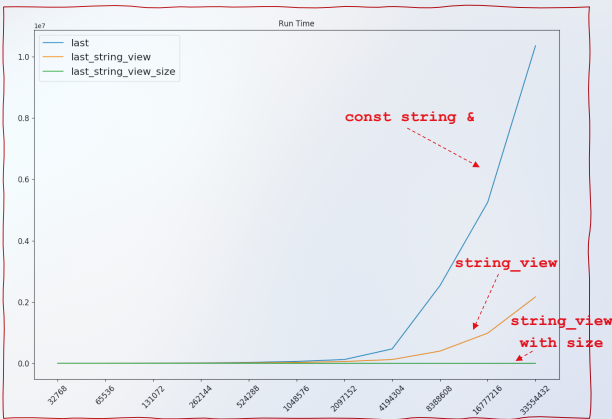
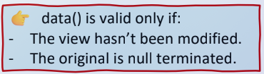

Move Semantics
---
Week 1, Lecture 2

* lvalue is a variable or object that persists beyond an expression
    * if you can take the address of a, it is most likely an lvalue.
```cpp

int a = 5;
&a; //valid because a is an lvalue
&(a+1) // invalid because (a+1) is not an lvalue

int* p1 = &a;
&p1;
&(++p1); //valid, preincrements
&(p1++); //invalid, creates a copy


```


Rule of 5:
- Destructor (~T)
- Copy constructor (T(const T&))
- Copy assignment operator (T& operator=(const T&))
- Move constructor (T(T&&) noexcept)
- Move assignment operator (T& operator=(T&&) noexcept)


## Elision
* c++20, unnamed return value skips over a step
* Needs to be:
    * unnamed
    * constructing something from unnamed return value
```cpp
//use std::move() when moving dynamic memory in a move constructor
int a = new int(5);
int b = std::move(a);
```

* If a function returns a value, it is a rvalue.
* Otherwise if it returns a reference, it is a lvalue.


```cpp
string MakeStr() {
    return string("string1");
}

string MakeStr2() {
    string temp("string2");
    return temp;
}

int main() {
    // Mandatory elision happens iff:
    // 1. The function returns an unnamed return value
    // 2. Saving the result into a copy constructor
    string r1(MakeStr2());

    string r2;
    // This does not elide because its going into assignment
    // Assignemnt cannot be elided ever
}
```

## Constructor Order Example

```cpp
const S& f1(const S& s) {
   return s;
}

S f2(const S& s) {
   S x(s);
   return x;
}

int main() {
   S a;
   S b = a;
   S c = f2(a);
   const S& d = f1(c);
   return 0;
}
```
```
Default (a)
Copy (a to b)
Copy (s to x)
Move (x to c)
Destructor (x)
Destructor (c)
Destructor (b)
Destructor (a)
```

---

# Basic Parallel Programming
*Week 2, Lecture 1, 01-21*

PA2
* Part 1 – Implement open addressed hash table (for cache performance)
* Part 2 – Implement a “dictionary” style attack
* Part 3 – Implement a “brute force” style attack
* We implement open addressing for cache performance instead of buckets
    * std::unordered_map is using buckets

### HashTable declaration
```cpp
template <typename KeyType, typename ValueType,
typename HashFuncType = std::hash<KeyType>>
class HashTable
```
In practice:
```cpp
HashTable<std::string, int> myTable;
```
Member data: 
```cpp
// Underlying hash table array (should be vector but we are practicing alloc/dealloc)
std::pair<KeyType, ValueType>* mTableData;
// Tracks whether an index is occupied
std::vector<bool> mOccupancy;
// Allocated capacity of hash table array
size_t mCapacity;
// Number of elements in HashTable
size_t mSize;
// Hash function
HashFuncType mHashFunc;
```

#### Dictionary Attack
* Key - Encrypted word from dictionary
* Value - Plain text word from dictionary
#### Bruteforce Attack
* Key - Encrypted word from the password file
* Value - Solved password (initially from empty string)

* They may hash to the same hash?
* You can hash each independently
* In a serial implementation, you would have to test 50^4 phrases one at a time.

### Lambda Functions
```cpp
std::sort(v.begin(), v.end(), [](int a, int b) -> bool { //dont really need to show the return type
// Return a greater than b instead of less
return a > b;
});
// v = {100, 10, -10}
```
* This uses a new syntax...

### Capture Clause
```cpp
int outOfScopeByDefaultCount = 0;
std::sort(v.begin(), v.end(), [&outOfScopeByDefaultCount](int a, int b) -> bool { //dont really need to show the return type
// Return a greater than b instead of less
    ++outOfScopeByDefaultCount;
    return a > b;
});
// v = {100, 10, -10}
```
***Lambda that returns a bool and takes in two ints:***
```cpp
std::function<bool(int, int)> greater =
[](int a, int b) {
return a > b;
};
```


## As of C++17, Algorithms support parallelization
```cpp
// Old version (still works if you want to use it):
std::for_each(v.begin(), v.end(), ...);

// New version (supports execution policy):
std::for_each(std::execution::par, v.begin(),
v.end(), ...);
```
* Only parallelize the outer loop
* Grain size


* Sharing data between parallel operations is okay if it's read Only
* Writing data can cause crashes'


```
Common Parallel Pitfall

//Sharing data between parallel operations is okay if it’s read-only

//However, if you write to shared data, you have to be very careful
std::vector<int> test = { 1, 1, 2, 3, 5 };
std::vector<int> copy;

// Let's use parallel_for_each to copy!
std::for_each(std::execution::par, test.begin(), test.end(),
[&](int i) {
copy.push_back(i); // This is bad...

});

for (auto i : copy) {
std::cout << i << std::endl;
```


# Basic Parallel Programming
*Week 3, Lecture 1, 01-26*
## Optimized Code

* Pass by reference
* Postpone variable declarations when possible
```cpp
T x;
if (b) {
x = t;
// Do stuff...
}
// Declare Inside (b is true half the time)
if (b) {
T x = t;
// Do stuff...
}
```
```cpp
// This constructs a string on every iteration
for (...) {
std::string myString;
}

// This constructs one string total
std::string myString;
for (...) {
}
```

* use += instead of +
* use ++() instead of ()++
* switches instead of else if chains
* be careful w strings
    * appending to a string dynamically is expensive if it grows (dynamic realloc)
* use '\n' instead of std::endl
    * because not only does it writes to a line, but it ALSO flushes a buffer, i.e. writes everything in buffer to a file
```cpp
for i ...
for j ...
for k ...
phrase = words[i] + words[j] + words[k]
//Do:
for i ...
for j ...
ijword = words[i] + words[j];
for k ...
phrase = ijword + words[k]
//Can make the above even better w/ +=
//Use \n!
```
* 80/20 rule
    * 80% of your execution time is spent in 20% of your code
    * Profilers can show which functions take up the most time
* inline functions
    * prevents function call overhead for small functions
        * compiler wont inline virtual functions or recursive or ie
* loop unrolling, instead of incrementing by 1 increment loop by 4 ie
* return unnnamed return values, optimization potential is high, might be moved into anothre object

## Unions
* unions can have multiple interpretations to look at memory
* ex. small string w literal chra array or large string with char pointer
```cpp
union
{
    struct
    {
        char* mData;
        size_t mSize;
        size_t mCapacity;

    } Large;

    struct
    {
    char mData[22];
    char mSize;

    bool mIsSmallString;

    } Small;
} mStr
;
```

## Sizeof and Vtables
*Week 3, Lecture 2, 01-28*
* **sizeof** returns number of bytes of a particular data type
```cpp
// Returns 4
sizeof(int)

char a;
// Returns 1
sizeof(a)

// Returns 1
sizeof(bool)
```
| Type    | Size (in bytes)              |
|---------|------------------------------|
| char    | 1                            |
| bool    | 1                            |
| int     | 4                            |
| float   | 4                            |
| double  | 8                            |
| pointer | 8 (since we are using 64-bit)|
```cpp
class Test1
{
    char c;
    int i;
};
```
*This is bad practice, because there is padding between c and i.* ***data types have to be at an address divisible by the size of the data type***

## Virtual functions
 * non virtual: known at compile time what function you are calling
 * virtual: sometimes not known at compile time what function you are using
 ```cpp
 struct Shape
 {
 // vtable* ptr = nullptr (pure virtual)
    virtual void Draw() = 0;
 };
 struct Triangle : Shape
 {
 // vtable* ptr = &Triangle_VTBL;
    virtual void Draw() { code } 
 };
 struct Circle : Shape
 {
 // vtable* ptr = &Circle_VTBL;
    virtual void Draw() { code } 
 };
```
**Polymorphism is when you have pointer/reference to base class and you call a function on it**
 ```cpp
 shape s = functionCall() //returns either triangle or circle
 s->Draw()
 ```



* You can assume for any virtual classes the rowsize is going to be 8 because it has a vtable
* sizeof empty class is 1.

## std::string\_view
#### Added in c++ 20


* *When passing a string literal char[] to a function that takes in a std::string, having the function paramater be a std::stringview instead is faster because you can view the char[] with std interpretations without having to create a new string*




# Smart Pointers
*Week 4, Lecture 1, 02-02*

### Memory Leaks
* Forgetting to deallocate memory is a very common mistake in C/C++ code
```cpp
int main()
{
    Square* mySquare = new Square();
    // OOPS!
    return 0;
}
```

* Sometimes the leaks can be caused by exceptions:
```cpp
bool badStuff = false;
Square* mySquare = new Square();

if (badStuff)
{
    throw std::exception();
}

// Deallocate, but what happens if there's a throw?
delete mySquare;
```

* Worse is when there's confusion between who should delete what:
```cpp
void doStuff(Shape* shape) {
    // Do stuff...
    // Done with shape, so delete it!
    delete shape;
}

int main() {
    Square* mySquare = new Square();
    doStuff(mySquare);
    delete mySquare;  // Uh-oh...

    return 0;
}
```

### Smart Pointer
* A **Smart Pointer** is an object that encapsulates dynamically allocated data
* There are several variations of smart pointers.
* **std::unique_ptr**: allows only a single reference at a time.
* **std::shared_ptr**: allows multiple references at once.
* **std::weak_ptr**: allows for weak references to shared pointers
* ***Rule of Zero***
    * you shouldnt have to overload any of the five member functions
    * can only be the case if you avoid using new altogether and instead use STL collections and smart pointers.

### Unique Pointer
* A **unique pointer** is a pointer that uniquely controls the lifetime of an object
* When the unique pointer goes out of scope, the object is deleted
* This solves the basic Memory Leaks 101/102 problems:
    - Forgetting to deallocate
    - Exception bypassing a delete statement

#### Minimal Declaration
```cpp
template <typename T>
class UniquePtr {
public:
    // Construct based on pointer to dynamic object
    explicit UniquePtr(T* obj);

    // Destructor (clean up memory)
    ~UniquePtr();

    // Allow moves (not shown)
    // ...

    // Overload dereferencing * and ->
    T& operator*();
    T* operator->();
private:
    // Disallow assignment/copy
    UniquePtr(const UniquePtr& other);
    UniquePtr& operator=(const UniquePtr& other);

    // Track the dynamically allocated object
    T* mObj;
};
```

#### Constructor/Destructor
```cpp
// Construct based on pointer to dynamic object
template <typename T>
UniquePtr<T>::UniquePtr(T* obj)
: mObj(obj)
{
}

// Destructor (clean up memory)
template <typename T>
UniquePtr<T>::~UniquePtr()
{
    // Delete dynamically allocated object
    delete mObj;
}
```

#### Operators
```cpp
// Overloaded dereferencing
template <typename T>
T& UniquePtr<T>::operator*()
{
    return *mObj;
}

template <typename T>
T* UniquePtr<T>::operator->()
{
    return mObj;
}
```

#### UniquePtr in Action
```cpp
int main() {
    // Construct a scoped pointer to a newly-allocated object
    UniquePtr<Square> mySquare(new Square());

    // Can call functions just like a regular pointer!
    mySquare->Draw();

    // No delete necessary
    return 0;
}
```
* In the case of unique pointers *we actually* ***DONT*** *want to implement copy* because there shouldn't be copies.

### Shared Pointer
* A **shared pointer** is used when an object has shared ownership between multiple pointers
* Uses **reference counting** to track the number of references to the dynamically allocated object is tracked
* When the references hit zero, the object will be automatically deallocated
* **Important!!!** – This is different from garbage collection (in a language such as Java) because there is a well-defined and consistent point where it will deallocate

#### Control Block
* A reference counting pointer needs a **control block** – another dynamically allocated object which tracks the number of references
* All instances of SharedPtr that point to the same object will also point to the same control block

#### Minimal Declaration
```cpp
// Declare the control block
struct ControlBlock {
    unsigned mSharedCount;
};

template <typename T>
class SharedPtr {
public:
    explicit SharedPtr(T* obj);
    // Allow copy construction/assignment
    SharedPtr(const SharedPtr& other);
    SharedPtr& operator=(const SharedPtr& other);

    // (Allow moves, too)
    // ...

    ~SharedPtr();
    T& operator*();
    T* operator->();
private:
    // Pointer to dynamically allocated object
    T* mObj;
    // Pointer to control block
    ControlBlock* mBlock;
};
```

#### Basic Constructor
```cpp
// Construct based on pointer to dynamic object
template <typename T>
SharedPtr<T>::SharedPtr(T* obj)
    : mObj(obj)
{
    // Dynamically allocate a new control block
    mBlock = new ControlBlock;
    // Initially, one reference (self)
    mBlock->mSharedCount = 1;
}
```

#### Copy Constructor
```cpp
// Copy constructor
template <typename T>
SharedPtr<T>::SharedPtr(const SharedPtr<T>& other)
{
    // Grab object and control block from other
    mObj = other.mObj;
    mBlock = other.mBlock;

    // Increment ref count
    mBlock->mSharedCount += 1;
}
```

#### Destructor
```cpp
// Destructor (reduce ref count)
template <typename T>
SharedPtr<T>::~SharedPtr()
{
    // Decrement ref count
    mBlock->mSharedCount -= 1;

    // If there are zero references, delete the object
    // and the control block
    if (mBlock->mSharedCount == 0) {
        delete mObj;
        delete mBlock;
    }
}
```

#### Using SharedPtr w/ Functions
```cpp
// Smart pointers should almost always be passed by value
void doStuff(SharedPtr<Shape> shape) {
    shape->Draw();
}

int main() {
    // Construct a scoped pointer to a newly-allocated object
    SharedPtr<Shape> myShape(new Square());

    doStuff(myShape);

    return 0;
}
```

#### Problems w/ SharedPtr
* **Q:** What if class A has a SharedPtr to class B, and class B has a SharedPtr to class A?
* **A:** Circular references means neither will ever be deleted

* **Q:** What if you want to have an "observer" that can observe the SharedPtr but not affect the number of references?
* **A:** It's currently not possible
