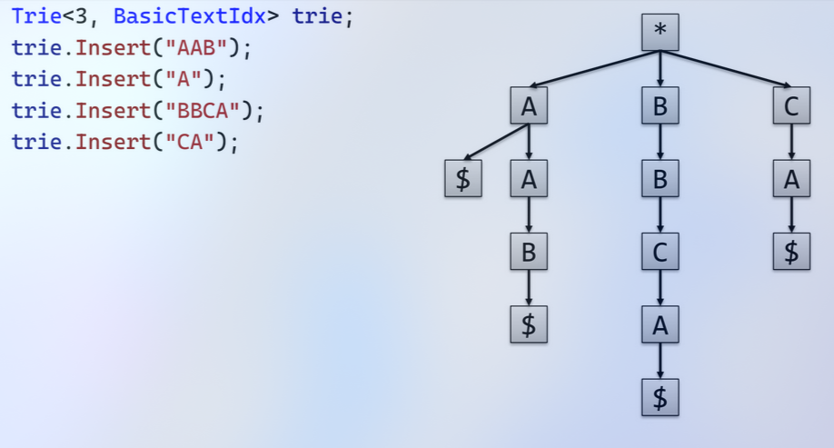
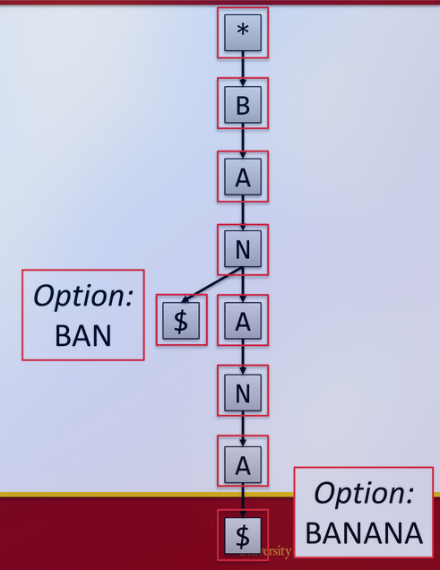
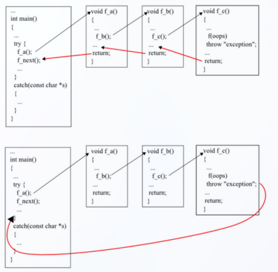

Move Semantics
---
Week 1, Lecture 2

* lvalue is a variable or object that persists beyond an expression
    * if you can take the address of a, it is most likely an lvalue.
```cpp

int a = 5;
&a; //valid because a is an lvalue
&(a+1) // invalid because (a+1) is not an lvalue

int* p1 = &a;
&p1;
&(++p1); //valid, preincrements
&(p1++); //invalid, creates a copy


```


Rule of 5:
- Destructor (~T)
- Copy constructor (T(const T&))
- Copy assignment operator (T& operator=(const T&))
- Move constructor (T(T&&) noexcept)
- Move assignment operator (T& operator=(T&&) noexcept)


## Elision
* c++20, unnamed return value skips over a step
* Needs to be:
    * unnamed
    * constructing something from unnamed return value
```cpp
//use std::move() when moving dynamic memory in a move constructor
int a = new int(5);
int b = std::move(a);
```

* If a function returns a value, it is a rvalue.
* Otherwise if it returns a reference, it is a lvalue.


```cpp
string MakeStr() {
    return string("string1");
}

string MakeStr2() {
    string temp("string2");
    return temp;
}

int main() {
    // Mandatory elision happens iff:
    // 1. The function returns an unnamed return value
    // 2. Saving the result into a copy constructor
    string r1(MakeStr2());

    string r2;
    // This does not elide because its going into assignment
    // Assignemnt cannot be elided ever
}
```

## Constructor Order Example

```cpp
const S& f1(const S& s) {
   return s;
}

S f2(const S& s) {
   S x(s);
   return x;
}

int main() {
   S a;
   S b = a;
   S c = f2(a);
   const S& d = f1(c);
   return 0;
}
```
```
Default (a)
Copy (a to b)
Copy (s to x)
Move (x to c)
Destructor (x)
Destructor (c)
Destructor (b)
Destructor (a)
```

---

# Basic Parallel Programming
*Week 2, Lecture 1, 01-21*

PA2
* Part 1 – Implement open addressed hash table (for cache performance)
* Part 2 – Implement a “dictionary” style attack
* Part 3 – Implement a “brute force” style attack
* We implement open addressing for cache performance instead of buckets
    * std::unordered_map is using buckets

### HashTable declaration
```cpp
template <typename KeyType, typename ValueType,
typename HashFuncType = std::hash<KeyType>>
class HashTable
```
In practice:
```cpp
HashTable<std::string, int> myTable;
```
Member data: 
```cpp
// Underlying hash table array (should be vector but we are practicing alloc/dealloc)
std::pair<KeyType, ValueType>* mTableData;
// Tracks whether an index is occupied
std::vector<bool> mOccupancy;
// Allocated capacity of hash table array
size_t mCapacity;
// Number of elements in HashTable
size_t mSize;
// Hash function
HashFuncType mHashFunc;
```

#### Dictionary Attack
* Key - Encrypted word from dictionary
* Value - Plain text word from dictionary
#### Bruteforce Attack
* Key - Encrypted word from the password file
* Value - Solved password (initially from empty string)

* They may hash to the same hash?
* You can hash each independently
* In a serial implementation, you would have to test 50^4 phrases one at a time.

### Lambda Functions
```cpp
std::sort(v.begin(), v.end(), [](int a, int b) -> bool { //dont really need to show the return type
// Return a greater than b instead of less
return a > b;
});
// v = {100, 10, -10}
```
* This uses a new syntax...

### Capture Clause
```cpp
int outOfScopeByDefaultCount = 0;
std::sort(v.begin(), v.end(), [&outOfScopeByDefaultCount](int a, int b) -> bool { //dont really need to show the return type
// Return a greater than b instead of less
    ++outOfScopeByDefaultCount;
    return a > b;
});
// v = {100, 10, -10}
```
***Lambda that returns a bool and takes in two ints:***
```cpp
std::function<bool(int, int)> greater =
[](int a, int b) {
return a > b;
};
```


## As of C++17, Algorithms support parallelization
```cpp
// Old version (still works if you want to use it):
std::for_each(v.begin(), v.end(), ...);

// New version (supports execution policy):
std::for_each(std::execution::par, v.begin(),
v.end(), ...);
```
* Only parallelize the outer loop
* Grain size


* Sharing data between parallel operations is okay if it's read Only
* Writing data can cause crashes'


```
Common Parallel Pitfall

//Sharing data between parallel operations is okay if it’s read-only

//However, if you write to shared data, you have to be very careful
std::vector<int> test = { 1, 1, 2, 3, 5 };
std::vector<int> copy;

// Let's use parallel_for_each to copy!
std::for_each(std::execution::par, test.begin(), test.end(),
[&](int i) {
copy.push_back(i); // This is bad...

});

for (auto i : copy) {
std::cout << i << std::endl;
```


# Basic Parallel Programming
*Week 3, Lecture 1, 01-26*
## Optimized Code

* Pass by reference
* Postpone variable declarations when possible
```cpp
T x;
if (b) {
x = t;
// Do stuff...
}
// Declare Inside (b is true half the time)
if (b) {
T x = t;
// Do stuff...
}
```
```cpp
// This constructs a string on every iteration
for (...) {
std::string myString;
}

// This constructs one string total
std::string myString;
for (...) {
}
```

* use += instead of +
* use ++() instead of ()++
* switches instead of else if chains
* be careful w strings
    * appending to a string dynamically is expensive if it grows (dynamic realloc)
* use '\n' instead of std::endl
    * because not only does it writes to a line, but it ALSO flushes a buffer, i.e. writes everything in buffer to a file
```cpp
for i ...
for j ...
for k ...
phrase = words[i] + words[j] + words[k]
//Do:
for i ...
for j ...
ijword = words[i] + words[j];
for k ...
phrase = ijword + words[k]
//Can make the above even better w/ +=
//Use \n!
```
* 80/20 rule
    * 80% of your execution time is spent in 20% of your code
    * Profilers can show which functions take up the most time
* inline functions
    * prevents function call overhead for small functions
        * compiler wont inline virtual functions or recursive or ie
* loop unrolling, instead of incrementing by 1 increment loop by 4 ie
* return unnnamed return values, optimization potential is high, might be moved into anothre object

## Unions
* unions can have multiple interpretations to look at memory
* ex. small string w literal chra array or large string with char pointer
```cpp
union
{
    struct
    {
        char* mData;
        size_t mSize;
        size_t mCapacity;

    } Large;

    struct
    {
    char mData[22];
    char mSize;

    bool mIsSmallString;

    } Small;
} mStr
;
```

## Sizeof and Vtables
*Week 3, Lecture 2, 01-28*
* **sizeof** returns number of bytes of a particular data type
```cpp
// Returns 4
sizeof(int)

char a;
// Returns 1
sizeof(a)

// Returns 1
sizeof(bool)
```
| Type    | Size (in bytes)              |
|---------|------------------------------|
| char    | 1                            |
| bool    | 1                            |
| int     | 4                            |
| float   | 4                            |
| double  | 8                            |
| pointer | 8 (since we are using 64-bit)|
```cpp
class Test1
{
    char c;
    int i;
};
```
*This is bad practice, because there is padding between c and i.* ***data types have to be at an address divisible by the size of the data type***

## Virtual functions
 * non virtual: known at compile time what function you are calling
 * virtual: sometimes not known at compile time what function you are using
 ```cpp
 struct Shape
 {
 // vtable* ptr = nullptr (pure virtual)
    virtual void Draw() = 0;
 };
 struct Triangle : Shape
 {
 // vtable* ptr = &Triangle_VTBL;
    virtual void Draw() { code } 
 };
 struct Circle : Shape
 {
 // vtable* ptr = &Circle_VTBL;
    virtual void Draw() { code } 
 };
```
**Polymorphism is when you have pointer/reference to base class and you call a function on it**
 ```cpp
 shape s = functionCall() //returns either triangle or circle
 s->Draw()
 ```


* You can assume for any virtual classes the rowsize is going to be 8 because it has a vtable
* sizeof empty class is 1.

## std::string\_view
#### Added in c++ 20


* *When passing a string literal char[] to a function that takes in a std::string, having the function paramater be a std::stringview instead is faster because you can view the char[] with std interpretations without having to create a new string*


# Smart Pointers
*Week 4, Lecture 1, 02-02*

### Memory Leaks
* Forgetting to deallocate memory is a very common mistake in C/C++ code
```cpp
int main()
{
    Square* mySquare = new Square();
    // OOPS!
    return 0;
}
```

* Sometimes the leaks can be caused by exceptions:
```cpp
bool badStuff = false;
Square* mySquare = new Square();

if (badStuff)
{
    throw std::exception();
}

// Deallocate, but what happens if there's a throw?
delete mySquare;
```

* Worse is when there's confusion between who should delete what:
```cpp
void doStuff(Shape* shape) {
    // Do stuff...
    // Done with shape, so delete it!
    delete shape;
}

int main() {
    Square* mySquare = new Square();
    doStuff(mySquare);
    delete mySquare;  // Uh-oh...

    return 0;
}
```

### Smart Pointer
* A **Smart Pointer** is an object that encapsulates dynamically allocated data
* There are several variations of smart pointers.
* **std::unique_ptr**: allows only a single reference at a time.
* **std::shared_ptr**: allows multiple references at once.
* **std::weak_ptr**: allows for weak references to shared pointers
* ***Rule of Zero***
    * you shouldnt have to overload any of the five member functions
    * can only be the case if you avoid using new altogether and instead use STL collections and smart pointers.

### Unique Pointer
* A **unique pointer** is a pointer that uniquely controls the lifetime of an object
* When the unique pointer goes out of scope, the object is deleted
* This solves the basic Memory Leaks 101/102 problems:
    - Forgetting to deallocate
    - Exception bypassing a delete statement

#### Minimal Declaration
```cpp
template <typename T>
class UniquePtr {
public:
    // Construct based on pointer to dynamic object
    explicit UniquePtr(T* obj);

    // Destructor (clean up memory)
    ~UniquePtr();

    // Allow moves (not shown)
    // ...

    // Overload dereferencing * and ->
    T& operator*();
    T* operator->();
private:
    // Disallow assignment/copy
    UniquePtr(const UniquePtr& other);
    UniquePtr& operator=(const UniquePtr& other);

    // Track the dynamically allocated object
    T* mObj;
};
```

#### Constructor/Destructor
```cpp
// Construct based on pointer to dynamic object
template <typename T>
UniquePtr<T>::UniquePtr(T* obj)
: mObj(obj)
{
}

// Destructor (clean up memory)
template <typename T>
UniquePtr<T>::~UniquePtr()
{
    // Delete dynamically allocated object
    delete mObj;
}
```

#### Operators
```cpp
// Overloaded dereferencing
template <typename T>
T& UniquePtr<T>::operator*()
{
    return *mObj;
}

template <typename T>
T* UniquePtr<T>::operator->()
{
    return mObj;
}
```

#### UniquePtr in Action
```cpp
int main() {
    // Construct a scoped pointer to a newly-allocated object
    UniquePtr<Square> mySquare(new Square());

    // Can call functions just like a regular pointer!
    mySquare->Draw();

    // No delete necessary
    return 0;
}
```
* In the case of unique pointers *we actually* ***DONT*** *want to implement copy* because there shouldn't be copies.

### Shared Pointer
* A **shared pointer** is used when an object has shared ownership between multiple pointers
* Uses **reference counting** to track the number of references to the dynamically allocated object is tracked
* When the references hit zero, the object will be automatically deallocated
* **Important!!!** – This is different from garbage collection (in a language such as Java) because there is a well-defined and consistent point where it will deallocate

#### Control Block
* A reference counting pointer needs a **control block** – another dynamically allocated object which tracks the number of references
* All instances of SharedPtr that point to the same object will also point to the same control block

#### Minimal Declaration
```cpp
// Declare the control block
struct ControlBlock {
    unsigned mSharedCount;
};

template <typename T>
class SharedPtr {
public:
    explicit SharedPtr(T* obj);
    // Allow copy construction/assignment
    SharedPtr(const SharedPtr& other);
    SharedPtr& operator=(const SharedPtr& other);

    // (Allow moves, too)
    // ...

    ~SharedPtr();
    T& operator*();
    T* operator->();
private:
    // Pointer to dynamically allocated object
    T* mObj;
    // Pointer to control block
    ControlBlock* mBlock;
};
```

#### Basic Constructor
```cpp
// Construct based on pointer to dynamic object
template <typename T>
SharedPtr<T>::SharedPtr(T* obj)
    : mObj(obj)
{
    // Dynamically allocate a new control block
    mBlock = new ControlBlock;
    // Initially, one reference (self)
    mBlock->mSharedCount = 1;
}
```

#### Copy Constructor
```cpp
// Copy constructor
template <typename T>
SharedPtr<T>::SharedPtr(const SharedPtr<T>& other)
{
    // Grab object and control block from other
    mObj = other.mObj;
    mBlock = other.mBlock;

    // Increment ref count
    mBlock->mSharedCount += 1;
}
```
* *This is one of the only times we want to implement the copy constructor as a shallow copy.*

#### Destructor
```cpp
// Destructor (reduce ref count)
template <typename T>
SharedPtr<T>::~SharedPtr()
{
    // Decrement ref count
    mBlock->mSharedCount -= 1;

    // If there are zero references, delete the object
    // and the control block
    if (mBlock->mSharedCount == 0) {
        delete mObj;
        delete mBlock;
    }
}
```

#### Using SharedPtr w/ Functions
```cpp
// Smart pointers should almost always be passed by value
void doStuff(SharedPtr<Shape> shape) {
    shape->Draw();
}

int main() {
    // Construct a scoped pointer to a newly-allocated object
    SharedPtr<Shape> myShape(new Square());

    doStuff(myShape);

    return 0;
}
```

#### Problems w/ SharedPtr
* **Q:** What if class A has a SharedPtr to class B, and class B has a SharedPtr to class A?
* **A:** Circular references means neither will ever be deleted

* **Q:** What if you want to have an "observer" that can observe the SharedPtr but not affect the number of references?
* **A:** It's currently not possible
* ***NOTE: MAKE SURE TO LOOK OVER FULL PTR CODE ON PIAZZA***

### Weak Pointer
* A **weak pointer** is a pointer that keeps a weak reference to a shared pointer
* A **weak reference** does not affect the lifetime of the object, because it uses a separate count (this is in contrast to the references we had before, which were **strong references**)

#### WeakPtr in Action
```cpp
WeakPtr<Shape> makeShapeWeak() {
    // Construct a SharedPtr
    SharedPtr<Shape> myShape(new Square());

    WeakPtr<Shape> weakShape(myShape);

    weakShape->Draw();

    // Return a WeakPtr to the shape
    return weakShape;
}

int main() {
    WeakPtr<Shape> weakPtr(makeShapeWeak());

    // Try to access weak reference here
    weakPtr->Draw();

    return 0;
}
```

### Custom Deleters
* You can declare a custom deleter to be called for deallocation – the simplest approach is to use a lambda expression:
```cpp
{
    std::shared_ptr<int> sharedArray(new int[10], [](int* obj) {
        delete[] obj;
    });
}
```
* The parameter should correspond to pointer to type
* When you use a custom deleter, you **can't** use make_shared
* In the prior example, as opposed to using a shared_ptr to an array, it may be better to just use an STL data structure
* However, custom deleters can be useful in the instance where there's some very specific deinitialization you must perform

### Unique Array
* Unique pointer has a templated version that takes in an array, which you can use like this:
```cpp
std::unique_ptr<int[]> uniqueArray(new int[10]);
```

# Tries and PA3
*Week 4, Lecture 2, 02-04*

## Tries


* A tree used typically to store strings and allows for efficient matching of patterns and implementing things like autocomplete
* **What to store for each node?**
    * We are going to "rule of zero" this, so no raw pointers.
    * Array of `unique_ptr`s to children (number of elements is alphabet size + 1; we will talk about the + 1 later)
    * `char` for the letter stored at the node
* **Trie template parameters**
    ```cpp
    template <size_t AlphabetSize, typename LetterToIdxFunc>
    class Trie
    ```
    * `AlphabetSize` - how many different letters are in the alphabet the trie needs to support (for space efficiency)
    * `LetterToIdxFunc` - maps a letter to a specific index in the array of children stored at each node
* **Example LetterToIdxFunc (alphabet size 3: A, B, C)**
    ```cpp
    struct BasicTextIdx {
        size_t operator()(char c) const {
            switch (c) {
                case 'A': return 0;
                case 'B': return 1;
                case 'C': return 2;
                default: return 0;
            }
        }
    };
    ```
* **What member data does the trie have?**
    * Pointer to root node
    * Instance of `LetterToIdxFunc` object
* *start/end*
    * `*`: start
    * `$`: end

### Insertion
* **Insert idea**
    * Get a string to insert; use existing nodes when appropriate or create new nodes if they don't already exist
    ```cpp
    void Insert(std::string_view word)
    ```
    

* **Breadth-First-Search traversal**
    * Not particularly useful on a trie, but helpful for writing test cases to ensure the trie is constructed to spec
    * Calls `visitFunc` on each node in the tree in a BFS manner, starting at root
    ```cpp
    void BFS(std::function<void(char)> visitFunc)
    ```
### FindPrefix
* Given a word, finds the longest prefix of that word which exists in the trie (or empty string if none)
```cpp
std::string FindPrefix(std::string_view word)
```
```cpp
Trie<26, EnglishTextIdx> t;
t.Insert("BAN");
t.Insert("BANANA");

t.FindPrefix("BANANAS");
// "BANANA"
```
* To implement efficiently, update the best option along the way during the search


### CompleteFromPrefix
* Given a prefix, finds the X shortest words in the trie that match the prefix
```cpp
std::vector<std::string> CompleteFromPrefix(std::string_view prefix, size_t count = 3)
```
* How to reconstruct the words from the trie?
    * Option 1: During the BFS also save the partially-completed word in the queue, so you can just add the additional letter as it continues (fastest)
    * Option 2: Once you hit a `$`, traverse the parents back to root and reverse the word
        * *Not really possible anymore*
    
## DNA Pattern Matching
*Nucleotides: `A, T, C, & G`*

* Given a long DNA sequence, find the largest prefix in the trie that matches
* Start at letter 0 of the sequence, `FindPrefix`, then go on to letter 1, `FindPrefix`, etc
* Will use to find some transcription factor proteins

### FASTA File Format
* A simple, text-based file format used to describe (among other things) DNA nucleotide sequences
* First line has a comment/description of the file, and subsequent lines have a sequence of nucleotides
* Example:
    ```
    >gi|319999821:c124527448-124526573 Pan troglodytes isolate Yerkes chimp
    ATGATACCCATCCAACTCACTGTCTTCTTCATGATCATCTATGTGCTTGAGTCCTTGACAATTATTGTGCAG
    AGCAGCCTAATTGTTGCAGTGCTGGGCAGAGAATGGCTGCAAGTCAGAAGGCTGATGCCTGTGGACATGATT
    CTCATCAGCCTGGGCATCTCTCGCTTCTGTCTACAGTGGGCATCAATGCTGAACAATTTTTGCTCCTATTTT
    AATTTGAATTATGTACTTTGCAACTTAACAATCACCTGGGAATTTTTTAATATCCTTACATTCT
    ```

# Modern C++ Topics

## constexpr
* C++11 feature to allow compile-time computation
* Example:
```cpp
constexpr int max(int a, int b)
{
    return (a > b ? a : b);
}
```
* Then if we have code like this:
```cpp
constexpr int a = max(5, 6);
```
* The compiler will replace it with:
```cpp
int a = 6;
```
* Better example:
```cpp
constexpr int factorial(int x)
{
    if (x > 0)
    {
        return x * factorial(x - 1);
    }
    else
    {
        return 1;
    }
}
```
* This won't compile:
```cpp
struct Test
{
    static const int CONST_INT = 0;
    static const float CONST_FLOAT = 0.0f;
};
```
* Error: "A member of type const float cannot have an in-class initializer"
* Use `constexpr` instead:
```cpp
struct Test
{
    static constexpr int CONST_INT = 0;
    static constexpr float CONST_FLOAT = 0.0f;
};
```

## Filesystem
* Purpose: "implementations of an interface that computer programs written in the C++ programming language may use to perform operations on file systems and their components, such as paths, regular files, and directories."
* Gives us a cross-platform way for common file system operations like finding if a file exists, getting the size of files, iterating over files in directories, and more

### Checking if Files exist
```cpp
// Shortcut so we don't have to type out std::filesystem every time
namespace fs = std::filesystem;

// Get the size of a file (throws an exception if it doesn't exist)
try
{
    auto fileSize = fs::file_size("CMakeLists.txt");
    std::cout << "Size = " << fileSize << "\n";
}
catch (fs::filesystem_error& e)
{
    std::cout << "Error from filesystem: " << e.what() << "\n";
}
```

### No exceptions?
* If you don't want to use exceptions, most versions of filesystem functions have an alternative version that takes in an `error_code`
```cpp
std::error_code ec;
auto fileSize = fs::file_size("asdf", ec);

// A default error code means it's ok
if (ec == std::error_code{}) {
    std::cout << "Size = " << fileSize << "\n";
} else {
    std::cout << "Error: " << ec.message() << "\n";
}
```

### Path objects
* You can construct a path object to a single file, and extract information from it:
```cpp
fs::path pathTest("CMakeLists.txt");

// Does this file exist?
if (fs::exists(pathTest))
{
    std::cout << "File exists\n";
}
else
{
    std::cout << "File does not exist\n";
}
```

### Iterating over all files in a directory
```cpp
for (const auto& p : fs::directory_iterator(".")) {
    std::cout << p.path() << "\n";
}
```

## Optional, Variant, Any
*(Only Optional is really ever used)*

### std::optional
* An optional is a wrapper that can optionally contain a value
* You can use this for cases where you are not sure whether or not something would happen, for example:
```cpp
// This function will try to convert a string to an integer and either --
// Return the integer if successful
// Return an unset optional if not successful
std::optional<int> TryGetInt(const std::string& s) {
    try {
        int result = std::stoi(s);
        return std::optional<int>(result);
    } catch (std::exception&) {
        // stoi failed so return an unset optional
        return std::optional<int>();
    }
}
```
* You can pass around optionals to other functions, and the bool conversion operator will be true if it is set, false otherwise:
```cpp
void CoutOptional(const std::optional<int>& o) {
    if (o) {
        std::cout << o.value() << "\n";
    } else {
        std::cout << "Optional was unset!\n";
    }
}
```
* This code:
```cpp
auto result1 = TryGetInt("10");
CoutOptional(result1);
auto result2 = TryGetInt("xyzw");
CoutOptional(result2);
```
* Would output:
```
10
Optional was unset!
```

### std::variant
* sort of like a union
### std::any
* have any type

## Feature Testing (C++20 Later)
### Testing for features
* Need to include the `<version>` header
* Allows you to test, with the preprocessor, if a feature is supported, like:
```cpp
#if defined(__cpp_lib_filesystem)
// This code is compiled if the platform
// support std::filesystem
std::filesystem::path myPath("hello");
#endif
```

### Better way of checking for parallel algos
```cpp
#if !defined(__cpp_lib_parallel_algorithm)
#if defined(__APPLE__)
// On Apple platforms, we can use this if we have to
#define PSTLD_HEADER_ONLY
#define PSTLD_HACK_INTO_STD
#include "pstld.h"
#else
#error "Parallel algos are required"
#endif // defined(__APPLE__)
#else
#include <algorithm>
#include <execution>
#endif // !defined(__cpp_lib_parallel_algorithm)
```

* NOTE: *go over slides 22+ on Move Semantics*

# Exceptions and RTTI; The Preprocessor
*Week 5, Lecture 1, 02-09*
* You can disable exceptions in your compiler and stl implementations will continue on failure. *Technically not STL compliant*


### What class type to throw?
* Never, ever, ever throw a class type whose constructor could also throw an exception
* Example:
```cpp
try
{
    throw std::string("BAD EXCEPTION HERE");
}
```
* What happens if string's constructor throws an exception?
* Answer: The program terminates

### std::exception
* Everything in the standard library throws an exception derived from `std::exception`, so you should also do this
```cpp
#include <exception>

class MyException : public virtual std::exception
{
    // what is a virtual function which returns a description
    const char* what() const noexcept override { return "MY EXCEPTION!"; }
};

// later on...
try
{
    throw MyException();
}
catch (std::exception& e)
{
    std::cout << e.what() << std::endl; // "MY EXCEPTION!"
}
```

### noexcept
* If you have a function that does not throw an exception back to the caller, specify `noexcept`
```cpp
// Default: Can throw anything
void Function1();

// Should not throw an exception
void Function2() noexcept;
```
* It is a guarantee to the caller that they do not have to worry about exceptions from this function
* NOTE: You have to specify `noexcept` on an override of `what`

### Exception-Safe Code
* If your code uses exceptions, you cannot guarantee that every function will reach a return statement
* Therefore, you cannot leave any dangling resources
* Example from Effective C++:
```cpp
void PrettyMenu::changeBackground(std::istream& imgSrc)
{
    lock(&mutex);
    delete bgImage;
    ++imageChanges;
    bgImage = new Image(imgSrc);
    unlock(&mutex);
}
```
* What happens if `new` throws an exception?
* Solution: use RAII

### RAII
* Resource Acquisition is Initialization
* Acquire the resource in the constructor, release in the destructor
```cpp
void PrettyMenu::changeBackground(std::istream& imgSrc)
{
    // Construct a LockGuard instead of just a function
    LockGuard lock(&mutex);
    delete bgImage;
    ++imageChanges;
    bgImage = new Image(imgSrc);
    // Not needed anymore, destructor of LockGuard does this
    // unlock(&mutex);
}
```
* Now regardless of how we exit changeBackground (normally, exception, etc), the unlock is guaranteed

### RTTI
* RTTI = Run-time Type Information (or Run-time Type Identification)
* In order for exceptions to work, C++ needs to figure out, at run-time, the type of the exception
* Thus, RTTI and exceptions sort of go hand in hand
* RTTI only works properly for classes that are polymorphic (e.g., have at least one virtual function, inherited or not)
* This is because RTTI information is stored in the virtual function table

#### dynamic_cast
* A down cast allows you to take a parent class pointer, and at runtime try to cast it to a child class
* Example: if you have a `Shape` pointer, and want to find out if it is a `Triangle` at runtime:
```cpp
Shape* myShape;
Triangle* myTriangle = dynamic_cast<Triangle*>(myShape);
if (myTriangle) // dynamic_cast returns 0 if not a triangle
{
    // do something
}
```
* Should only be used in cases where you have a function you do not want to expose in the base class, which is rare

#### typeid
* Allows you to figure out the type of something at runtime
```cpp
class Person
{
public:
    virtual ~Person() {}
};
class Employee : public Person
{
public:
};

// Later...
Person* ptr = new Employee();
if (typeid(*ptr) == typeid(Employee))
{
    // This is an employee!!
}
```

#### std::type_info
* The use of `typeid` returns a `std::type_info` class, which is defined in `<typeinfo>`
* Notable member functions:
    * `operator!=` (self-explanatory)
    * `operator==` (self-explanatory)
    * `name` (returns implementation-specific name, as a `const char*`)

#### Default RTTI Drawback
* Every single class with a virtual function has additional RTTI information stored in its virtual function table
* What happens if you have 10,000 classes with virtual functions, but you only need RTTI for 100 of them?
* Answer: Unnecessary memory waste
* Some C++ libraries (LLVM, for example) implement their own RTTI for this reason

### The Preprocessor
* Processes all `#` directives to generate the final C++ code which will be compiled
* The resulting code is often called a "translation unit"
* Example 1:
```cpp
#include "dbg_assert.h"
// dbg_assert.h code is essentially copy/pasted at this line
```
* Example 2:
```cpp
// Compile this only in a "debug" build
#ifdef _DEBUG
// Random debug code...
#endif
```
* Example 3:
```cpp
// Replaces "MAX_POOL_SIZE" with 256 in code
// (Breaks Rule #2 in Effective C++, use const instead)
#define MAX_POOL_SIZE 256
```

### Be careful with #include
* Don't make an "everything.h" that you include everywhere:
```cpp
// INCLUDE EVERYTHING
#include <algorithm>
#include <bitset>
#include <cassert>
#include <cctype>
#include <cerrno>
#include <cfloat>
// ...
```
* Only include files you really need to include

#### Include "Guard"
* May have seen this before:
```cpp
#ifndef _MYFILE_H_
#define _MYFILE_H_

// stuff here

#endif // _MYFILE_H_
```
* The above works, but a preferred method is to put this at the start of the header (works in Visual Studio, Clang, and GCC):
```cpp
#pragma once
```

#### Macros
* Not only can we define values like this:
```cpp
#define MY_VALUE 10
```
* We can replace one expression with another:
```cpp
#define max(a,b) (((a) > (b)) ? (a) : (b))
```
* So if you write code like this:
```cpp
std::cout << max(5, 6);
```
* Preprocessor replaces max with the defined code and our parameters:
```cpp
std::cout << (((5) > (6)) ? (5) : (6));
```
* Problem 2: must be very careful with parentheses
```cpp
#define MULT(x, y) x * y

// What if I do this?
int z = MULT(3 + 2, 4 + 2);
```
* Preprocessor evaluates it to:
```cpp
int z = 3 + 2 * 4 + 2;
```
* Instead, you need a lot of parentheses:
```cpp
#define MULT(x, y) ((x) * (y))
```
* So the preprocessor gives you:
```cpp
int z = ((3 + 2) * (4 + 2));
```
* Preprocessor trick - stringify
    * You can convert any token passed to the preprocessor to a string using `#` in front of the parameter name
```cpp
#include <iostream>

#define TO_STRING(str) #str

int main() {
    std::cout << TO_STRING(10 + 5) << std::endl;
    return 0;
}
```

# Functional Programming; Threads
*Week 5, Lecture 2, 02-11*
*Not on midterm, is on PA4*
* **Imperative Language** is a language that does not have any classes.
    * *C, Fortran*
* **Functional** use fnuctions for everything.
    * *Haskell, Ocaml, LISP*
* ***C++*** *is crossover between imperative and OOP. Because you don't NEED to use classes but just use templates.*
    * *With the additional of lambdas in std11 its arguably also a functional language.*
* ***note: whenever using a lambda if you capture [this] make sure that the this object outlives the lambda to avoid undefined behavior.***

## Functional Programming
* Functions are **First class citizens**
    * Passed as argument to other functions
    * Returned from other functions
    * Can be assigned to a variable or stored in a container
    * ***C++ Lambda satisfy these criteria***

* In functional programming, *higher-order functions* - functions that can accept other functions as arguments - are allowed
* Three very common higher-order functions:
    * **map** - apply a function to each element in a collection, storing the result in another collection
    * **filter** - remove elements from a collection based on a filtering function
    * **reduce** - reduce a collection to a single value by applying a binary operation repeatedly
* All three of these higher-order functions are more or less supported in C++, though they have different names

* Generally, functional programming tries to largely limit *side effects* - having any interaction with the world "outside" from the instance of a function call
* Examples of side effects:
    * Modifying data passed into the function (e.g., pass-by-reference where you change the values)
    * Modifying global or static data
    * **Any I/O** (*can be hard to realistically enforce*)

* Functional programs should generally be stateless - in a practical sense, this means no globals, statics, etc
* All functions should accept at least one argument
* All functions must return data or another function - no void functions
* Avoid loops/iteration - always use recursion or higher-order functions. Some functional programming languages do not have any iteration at all

### Average a Vector - An Example
```cpp
// Imperative-style implementation
float averageVector(const std::vector<float>& v) {
    float sum = 0.0f;
    for (auto& i : v) {
        sum += i;
    }

    return sum / v.size();
}
```

### Average a Vector, Cont'd
* To follow the principles of functional programming, the loop go...
```cpp
float averageVector(const std::vector<float>& v) {
    float sum = 0.0f;
    for (auto& i : v) {
        sum += i;
    }

    return sum / v.size();
}
```

### Functional Decomposition
* *Functional decomposition* is a fancy way of saying "break a function into sub functions"
* Let's make an average function that computes the average given a sum and a quantity:
```cpp
float average(float sum, size_t qty) {
    return sum / qty;
}
```

### Reduce
* *reduce* - take a collection and reduce it to a single value by applying a binary operator repeatedly
* *We want to reduce the collection to the sum of its components!*
* In C++, reduce can be implemented via `std::accumulate` in the `<numeric>` header

### Sum Vector
```cpp
float sumVector(const std::vector<float>& v) {
    // std::accumulate can work as a REDUCE
    return std::accumulate(v.begin(), // Start of range
                           v.end(),   // End of range
                           0.0f,      // Initial value
                           // Binary lambda expression
                           [](const float& a, const float& b) {
                               return a + b;
                           });
}
```
* Note: default `std::accumulate` already uses `a + b`, so the custom lambda is not necessary

### Putting it Together
```cpp
// Functional implementation
float average(float sum, size_t qty) {
    return sum / qty;
}

float sumVector(const std::vector<float>& v) {
    return std::accumulate(v.begin(), v.end(), 0.0f);
}

float averageVector(const std::vector<float>& v) {
    return average(sumVector(v), v.size());
}
```

### all_of, any_of, none_of - A lambda usage case
* A series of new functions in C++11 in `<algorithm>`
* Given a range of values and a unary predicate with this signature:
```cpp
bool predicate(const T& a);
```
* It will return true if *all_of*, *any_of*, or *none_of* the elements satisfy the condition

### all_of Example
```cpp
std::vector<int> v1{ 2, 4, 6, 8, 10 };
if (std::all_of(v1.begin(), v1.end(), [](const int& i) {
    return (i % 2) == 0;
}))
{
    std::cout << "All are even!" << std::endl;
}
else
{
    std::cout << "All aren't even" << std::endl;
}
```

### copy_if - Another Example
```cpp
std::vector<int> from{ 1, 2, 3, 4, 5 };
std::vector<int> to;

auto is_odd = [](const int& i) { return i % 2 == 1 }; 

// Copy from the "from" container into the "to" container,
// only if is_odd returns true for that element
std::copy_if(from.begin(), from.end(),
             std::back_inserter(to), is_odd);
```

### copy_n
* Copies n elements from a source collection to a back_inserted collection

### Map
* The *map* higher-order function applies a function to each element, saving the results in a different collection
* It can be approximated by the `std::transform` function:
```cpp
std::vector<float> divEachBy(const std::vector<float>& v, float denominator) {
    std::vector<float> ret;
    // std::transform can be used to map
    std::transform(v.begin(),   // Start of range
                   v.end(),     // End of range
                   std::back_inserter(ret), // Collection to insert into
                   // Unary function that returns transform value
                   [denominator](const float& a) {
                       return a / denominator;
                   });
    return ret;
}
```

### Write our own "map" function?
```cpp
template <typename T, typename U>
T map(const T& v, U f) {
    T ret;
    std::transform(v.begin(), v.end(),
                   std::back_inserter(ret), f);
    return ret;
}
```
* (Aside: This is an example of where using `namespace std` may not be good)

### Filter
* The *filter* higher-order function removes elements based on a Boolean filter condition
* We could write this higher-order function, too:
```cpp
template <typename T, typename U>
T filter(const T& v, U f) {
    T ret;
    std::copy_if(v.begin(),  // Start of range
                 v.end(),    // End of range
                 std::back_inserter(ret), // Where to insert
                 f); // Boolean unary function
    return ret;
}
```

### Filter in Action
```cpp
std::list<int> filterIsPositive(const std::list<int>& l) {
    return filter(l, [](const int& a) {
        return a > 0;
    });
}
```

### Generate
* Helper that can be used to insert elements into a collection, where elements need to be initialized with a particular function
```cpp
// Make a vector w/ 10 elements
std::vector<int> v(10);
std::generate(v.begin(),  // start of range
              v.end(),    // end of range
              // Lambda that returns generated value
              []() {
                  return rand();
              });
```

### adjacent_difference
```cpp
std::vector<int> from({ 10, 15, 20, 25, 30, 35 });
std::vector<int> to;

std::adjacent_difference(from.begin(), // Start of range
                         from.end(),   // End of range
                         std::back_inserter(to), // Collection to insert into
                         // Lambda to compute difference (defaults to subtraction)
                         [](int a, int b) {
                             return a - b;
                         });
```
* The first element in the resulting range is a copy; the rest of the collection is differences (index 1 - index 0 of the source is stored in index 1 of the destination, and so on)
* This subtracts `idx - 1` from `idx` for each element
* So in the above, `to` will contain: `{ 10, 5, 5, 5, 5, 5 }`

## Threads Basics

### Process
* A computer program:
    * A passive collection of instructions typically stored in a file on disk
* A process is a program in execution
    * **Allocated memory** (heap, stack, code)
    * **OS descriptors** of resources that are allocated to the process: such as file descriptors
    * **Security attributes**, such as the process owner and the process' set of permissions
    * **Processor state** (context), such as the content of registers and physical memory addressing
* Several processes may be associated with the same program
    * Multiple instances of a program running at the same time

### Thread
* The smallest sequence of instructions that can be managed independently by a OS
* Multiple threads can exist within one process
    * Can execute concurrently and sharing resources such as memory, while different processes do not share these resources
* Threads of a process share
    * Code
    * Memory (Global variables, heap)

### std::thread - Create Threads Using Function Pointers

#### Calculating the sum
* Calculating the sum of numbers in the range `[start, end)`
```cpp
void AccumulateRange(uint64_t &sum, uint64_t start, uint64_t end) {
    sum = 0;
    for (uint64_t i = start; i < end; i++) {
        sum += i;
    }
}
```

#### Calculating the sum (two threads)
* Two threads each working on half of the range
* `total = partial_sum[0] + partial_sum[1]`

#### Pointer to Function
```cpp
std::thread t1(AccumulateRange,
               std::ref(partial_sums[0]), 0, 1000 / 2);
```

#### Use std::ref to pass by reference
* All parameters are passed by value; use `std::ref` to pass by reference
* `std::ref` wraps the argument in a `std::reference_wrapper` so `std::thread` stores a reference instead of copying the value
* Use `std::ref` instead of `&` because `std::thread` copies arguments into its internal storage; a raw `&` would pass a pointer and change the function signature, while `std::ref` keeps the same reference parameter type

### Joining Threads
* Create and start each thread
* Wait for threads to end with `join`
```cpp
std::thread t1(AccumulateRange, std::ref(partial_sums[0]), 0, step);
std::thread t2(AccumulateRange, std::ref(partial_sums[1]), step, number_of_threads * step);

t1.join();
t2.join();
```

### std::thread - Create Threads Using Lambda Functions

#### What's a lambda?
* **Reminder:** Lambda function is a function definition that is not bound to an identifier
```cpp
[capture](parameters) -> return_type { function_body }
```
```cpp
[](int x, int y) -> int { return x + y; }
```
```cpp
std::vector<int> some_list{ 1, 2, 3, 4, 5 };
int total = 0;
std::for_each(begin(some_list), end(some_list),
              [&total](int x) { total += x; });
```

#### Using lambdas
* Calculating the sum of numbers in the range `[start, end)`
```cpp
[i, &partial_sums, step] {
    for (uint64_t j = i * step; j < (i + 1) * step; j++) {
        partial_sums[i] += j;
    }
}
```
```cpp
for (uint64_t i = 0; i < number_of_threads; i++) {
    threads.push_back(std::thread([i, &partial_sums, step] {
        for (uint64_t j = i * step; j < (i + 1) * step; j++) {
            partial_sums[i] += j;
        }
    }));
}
```

#### Using lambdas (overview)
* Vector of threads
* Vector of sums
* Create, start, and push each thread into a vector
* Wait for threads to end
* Calculate total sum

#### Using lambdas - takeaway
* As an alternative to passing a parameter, we can pass references to lambda functions using **lambda capture**

### std::async - Task, Futures, and Promises

#### Async - pointer to function
```cpp
uint64_t GetRangeSum(uint64_t start, uint64_t end) {
    uint64_t sum = 0;
    for (uint64_t i = start; i < end; i++) {
        sum += i;
    }
    return sum;
}

auto t = std::async(GetRangeSum, 0, 100 / 2);
auto return_value = t.get();
```
* `std::async` returns a **future** (similar to a JS Promise)
* `t.get()` blocks until the task finishes; do other work first and call `get()` when you need the result

#### Async - tasks in a vector
```cpp
std::vector<std::future<uint64_t>> tasks;

for (uint64_t i = 0; i < number_of_threads; i++) {
    tasks.push_back(std::async(GetRangeSum, i * step, (i + 1) * step));
}

uint64_t total = 0;
for (auto& t : tasks) {
    total += t.get();
}
```
* Create, start, and push each task into a vector
* Wait for tasks to end and read return values

#### std::launch policy
* `std::async` can take one more parameter of type `std::launch`:
    * `std::launch::async`: the function will run on its own (new) thread
    * `std::launch::deferred`: the function call will be deferred until either `wait()` or `get()` is called on the future
    * `std::launch::async | std::launch::deferred`: the implementation may choose (default)
```cpp
auto t = std::async(policy, GetRangeSum, 0, 100 / 2);
```

# Genetic Algorithms
*Week 6, Lecture 1, 02-18*
## PA4
* Traveling Salesman
    * *Given LAX + 19 Diff locations in LA/
    * Find the shortest path that starts at LAX, visits each other location once, and returns to LAX.
    * Assume you can use a helicopter because roads add complexity*
* While there are more efficient algorithms, they still are extremely slow (non-polynomial time)
* Instead use a *heuristic algorithm* - try to find a solution that we think is pretty good (but cannot prove how good it is)
* A *genetic algorithm* (GA) is one type of heuristic algorithm
