Move Semantics
---
Week 1, Lecture 2

* lvalue is a variable or object that persists beyond an expression
    * if you can take the address of a, it is most likely an lvalue.
```cpp

int a = 5;
&a; //valid because a is an lvalue
&(a+1) // invalid because (a+1) is not an lvalue

int* p1 = &a;
&p1;
&(++p1); //valid, preincrements
&(p1++); //invalid, creates a copy


```
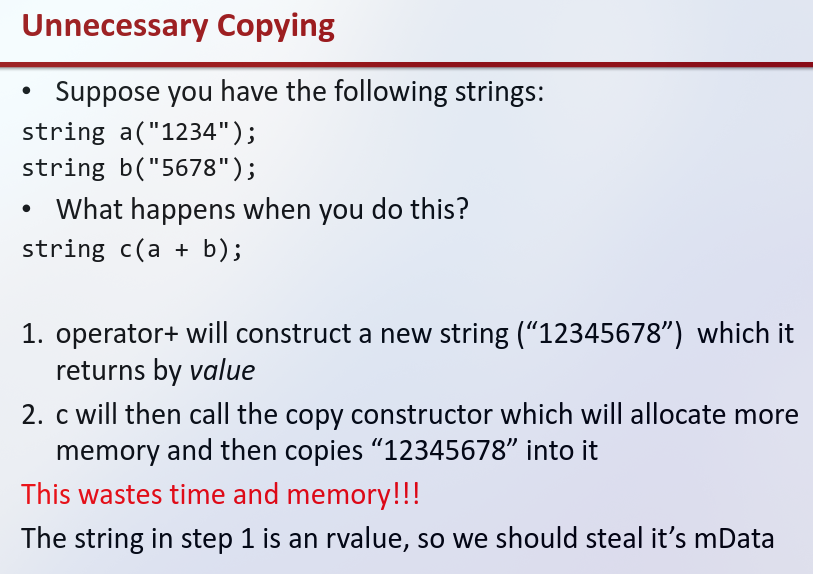


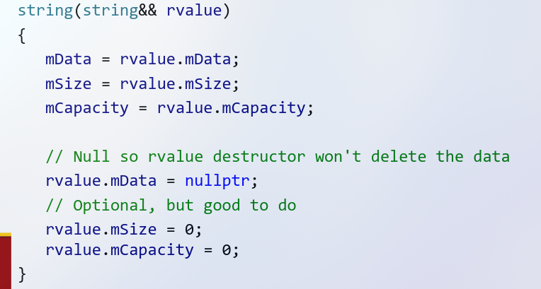


Rule of 5:
- Destructor (~T)
- Copy constructor (T(const T&))
- Copy assignment operator (T& operator=(const T&))
- Move constructor (T(T&&) noexcept)
- Move assignment operator (T& operator=(T&&) noexcept)


## Elision
* c++20, unnamed return value skips over a step
* Needs to be:
    * unnamed
    * constructing something from unnamed return value
```cpp
//use std::move() when moving dynamic memory in a move constructor
int a = new int(5);
int b = std::move(a);
```

* If a function returns a value, it is a rvalue.
* Otherwise if it returns a reference, it is a lvalue.


```cpp
string MakeStr() {
    return string("string1");
}

string MakeStr2() {
    string temp("string2");
    return temp;
}

int main() {
    // Mandatory elision happens iff:
    // 1. The function returns an unnamed return value
    // 2. Saving the result into a copy constructor
    string r1(MakeStr2());

    string r2;
    // This does not elide because its going into assignment
    // Assignemnt cannot be elided ever
}
```

## Constructor Order Example

```cpp
const S& f1(const S& s) {
   return s;
}

S f2(const S& s) {
   S x(s);
   return x;
}

int main() {
   S a;
   S b = a;
   S c = f2(a);
   const S& d = f1(c);
   return 0;
}
```
```
Default (a)
Copy (a to b)
Copy (s to x)
Move (x to c)
Destructor (x)
Destructor (c)
Destructor (b)
Destructor (a)
```

---

# Basic Parallel Programming
*Week 2, Lecture 1, 01-21*

PA2
* Part 1 – Implement open addressed hash table (for cache performance)
* Part 2 – Implement a “dictionary” style attack
* Part 3 – Implement a “brute force” style attack
* We implement open addressing for cache performance instead of buckets
    * std::unordered_map is using buckets

### HashTable declaration
```cpp
template <typename KeyType, typename ValueType,
typename HashFuncType = std::hash<KeyType>>
class HashTable
```
In practice:
```cpp
HashTable<std::string, int> myTable;
```
Member data: 
```cpp
// Underlying hash table array (should be vector but we are practicing alloc/dealloc)
std::pair<KeyType, ValueType>* mTableData;
// Tracks whether an index is occupied
std::vector<bool> mOccupancy;
// Allocated capacity of hash table array
size_t mCapacity;
// Number of elements in HashTable
size_t mSize;
// Hash function
HashFuncType mHashFunc;
```

#### Dictionary Attack
* Key - Encrypted word from dictionary
* Value - Plain text word from dictionary
#### Bruteforce Attack
* Key - Encrypted word from the password file
* Value - Solved password (initially from empty string)

* They may hash to the same hash?
* You can hash each independently
* In a serial implementation, you would have to test 50^4 phrases one at a time.

### Lambda Functions
```cpp
std::sort(v.begin(), v.end(), [](int a, int b) -> bool { //dont really need to show the return type
// Return a greater than b instead of less
return a > b;
});
// v = {100, 10, -10}
```
* This uses a new syntax...

### Capture Clause
```cpp
int outOfScopeByDefaultCount = 0;
std::sort(v.begin(), v.end(), [&outOfScopeByDefaultCount](int a, int b) -> bool { //dont really need to show the return type
// Return a greater than b instead of less
    ++outOfScopeByDefaultCount;
    return a > b;
});
// v = {100, 10, -10}
```
***Lambda that returns a bool and takes in two ints:***
```cpp
std::function<bool(int, int)> greater =
[](int a, int b) {
return a > b;
};
```


## As of C++17, Algorithms support parallelization
```cpp
// Old version (still works if you want to use it):
std::for_each(v.begin(), v.end(), ...);

// New version (supports execution policy):
std::for_each(std::execution::par, v.begin(),
v.end(), ...);
```
* Only parallelize the outer loop
* Grain size


* Sharing data between parallel operations is okay if it's read Only
* Writing data can cause crashes'


```
Common Parallel Pitfall

//Sharing data between parallel operations is okay if it’s read-only

//However, if you write to shared data, you have to be very careful
std::vector<int> test = { 1, 1, 2, 3, 5 };
std::vector<int> copy;

// Let's use parallel_for_each to copy!
std::for_each(std::execution::par, test.begin(), test.end(),
[&](int i) {
copy.push_back(i); // This is bad...

});

for (auto i : copy) {
std::cout << i << std::endl;
```
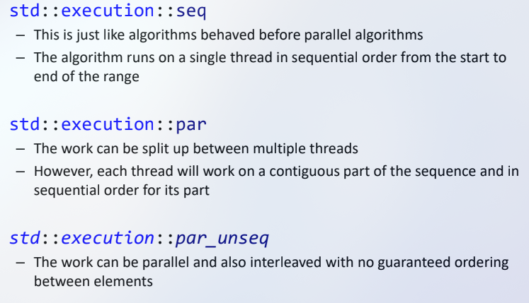

# Basic Parallel Programming
*Week 3, Lecture 1, 01-26*
## Optimized Code

* Pass by reference
* Postpone variable declarations when possible
```cpp
T x;
if (b) {
x = t;
// Do stuff...
}
// Declare Inside (b is true half the time)
if (b) {
T x = t;
// Do stuff...
}
```
```cpp
// This constructs a string on every iteration
for (...) {
std::string myString;
}

// This constructs one string total
std::string myString;
for (...) {
}
```

* use += instead of +
* use ++() instead of ()++
* switches instead of else if chains
* be careful w strings
    * appending to a string dynamically is expensive if it grows (dynamic realloc)
* use '\n' instead of std::endl
    * because not only does it writes to a line, but it ALSO flushes a buffer, i.e. writes everything in buffer to a file
```cpp
for i ...
for j ...
for k ...
phrase = words[i] + words[j] + words[k]
//Do:
for i ...
for j ...
ijword = words[i] + words[j];
for k ...
phrase = ijword + words[k]
//Can make the above even better w/ +=
//Use \n!
```
* 80/20 rule
    * 80% of your execution time is spent in 20% of your code
    * Profilers can show which functions take up the most time
* inline functions
    * prevents function call overhead for small functions
        * compiler wont inline virtual functions or recursive or ie
* loop unrolling, instead of incrementing by 1 increment loop by 4 ie
* return unnnamed return values, optimization potential is high, might be moved into anothre object

## Unions
* unions can have multiple interpretations to look at memory
* ex. small string w literal chra array or large string with char pointer
```cpp
union
{
    struct
    {
        char* mData;
        size_t mSize;
        size_t mCapacity;

    } Large;

    struct
    {
    char mData[22];
    char mSize;

    bool mIsSmallString;

    } Small;
} mStr
;
```

## Sizeof and Vtables
*Week 3, Lecture 2, 01-28*
* **sizeof** returns number of bytes of a particular data type
```cpp
// Returns 4
sizeof(int)

char a;
// Returns 1
sizeof(a)

// Returns 1
sizeof(bool)
```
| Type    | Size (in bytes)              |
|---------|------------------------------|
| char    | 1                            |
| bool    | 1                            |
| int     | 4                            |
| float   | 4                            |
| double  | 8                            |
| pointer | 8 (since we are using 64-bit)|
```cpp
class Test1
{
    char c;
    int i;
};
```
*This is bad practice, because there is padding between c and i.* ***data types have to be at an address divisible by the size of the data type***

## Virtual functions
 * non virtual: known at compile time what function you are calling
 * virtual: sometimes not known at compile time what function you are using
 ```cpp
 struct Shape
 {
 // vtable* ptr = nullptr (pure virtual)
    virtual void Draw() = 0;
 };
 struct Triangle : Shape
 {
 // vtable* ptr = &Triangle_VTBL;
    virtual void Draw() { code } 
 };
 struct Circle : Shape
 {
 // vtable* ptr = &Circle_VTBL;
    virtual void Draw() { code } 
 };
```
**Polymorphism is when you have pointer/reference to base class and you call a function on it**
 ```cpp
 shape s = functionCall() //returns either triangle or circle
 s->Draw()
 ```
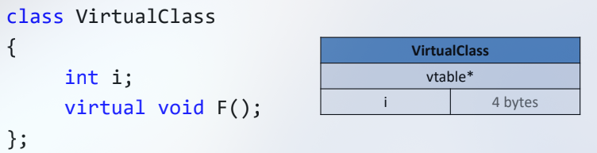

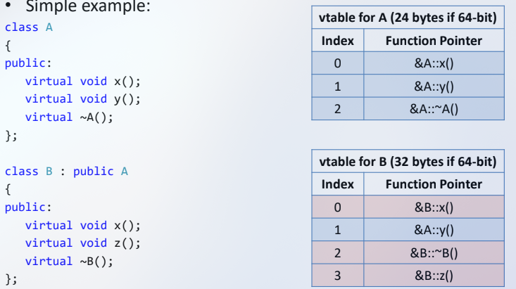

* You can assume for any virtual classes the rowsize is going to be 8 because it has a vtable
* sizeof empty class is 1.

## std::string\_view
#### Added in c++ 20
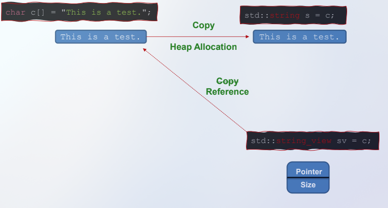

* *When passing a string literal char[] to a function that takes in a std::string, having the function paramater be a std::stringview instead is faster because you can view the char[] with std interpretations without having to create a new string*
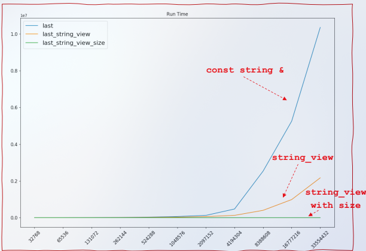

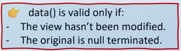

# Smart Pointers
*Week 4, Lecture 1, 02-02*

### Memory Leaks
* Forgetting to deallocate memory is a very common mistake in C/C++ code
```cpp
int main()
{
    Square* mySquare = new Square();
    // OOPS!
    return 0;
}
```

* Sometimes the leaks can be caused by exceptions:
```cpp
bool badStuff = false;
Square* mySquare = new Square();

if (badStuff)
{
    throw std::exception();
}

// Deallocate, but what happens if there's a throw?
delete mySquare;
```

* Worse is when there's confusion between who should delete what:
```cpp
void doStuff(Shape* shape) {
    // Do stuff...
    // Done with shape, so delete it!
    delete shape;
}

int main() {
    Square* mySquare = new Square();
    doStuff(mySquare);
    delete mySquare;  // Uh-oh...

    return 0;
}
```

### Smart Pointer
* A **Smart Pointer** is an object that encapsulates dynamically allocated data
* There are several variations of smart pointers.
* **std::unique_ptr**: allows only a single reference at a time.
* **std::shared_ptr**: allows multiple references at once.
* **std::weak_ptr**: allows for weak references to shared pointers
* ***Rule of Zero***
    * you shouldnt have to overload any of the five member functions
    * can only be the case if you avoid using new altogether and instead use STL collections and smart pointers.

### Unique Pointer
* A **unique pointer** is a pointer that uniquely controls the lifetime of an object
* When the unique pointer goes out of scope, the object is deleted
* This solves the basic Memory Leaks 101/102 problems:
    - Forgetting to deallocate
    - Exception bypassing a delete statement

#### Minimal Declaration
```cpp
template <typename T>
class UniquePtr {
public:
    // Construct based on pointer to dynamic object
    explicit UniquePtr(T* obj);

    // Destructor (clean up memory)
    ~UniquePtr();

    // Allow moves (not shown)
    // ...

    // Overload dereferencing * and ->
    T& operator*();
    T* operator->();
private:
    // Disallow assignment/copy
    UniquePtr(const UniquePtr& other);
    UniquePtr& operator=(const UniquePtr& other);

    // Track the dynamically allocated object
    T* mObj;
};
```

#### Constructor/Destructor
```cpp
// Construct based on pointer to dynamic object
template <typename T>
UniquePtr<T>::UniquePtr(T* obj)
: mObj(obj)
{
}

// Destructor (clean up memory)
template <typename T>
UniquePtr<T>::~UniquePtr()
{
    // Delete dynamically allocated object
    delete mObj;
}
```

#### Operators
```cpp
// Overloaded dereferencing
template <typename T>
T& UniquePtr<T>::operator*()
{
    return *mObj;
}

template <typename T>
T* UniquePtr<T>::operator->()
{
    return mObj;
}
```

#### UniquePtr in Action
```cpp
int main() {
    // Construct a scoped pointer to a newly-allocated object
    UniquePtr<Square> mySquare(new Square());

    // Can call functions just like a regular pointer!
    mySquare->Draw();

    // No delete necessary
    return 0;
}
```
* In the case of unique pointers *we actually* ***DONT*** *want to implement copy* because there shouldn't be copies.

### Shared Pointer
* A **shared pointer** is used when an object has shared ownership between multiple pointers
* Uses **reference counting** to track the number of references to the dynamically allocated object is tracked
* When the references hit zero, the object will be automatically deallocated
* **Important!!!** – This is different from garbage collection (in a language such as Java) because there is a well-defined and consistent point where it will deallocate

#### Control Block
* A reference counting pointer needs a **control block** – another dynamically allocated object which tracks the number of references
* All instances of SharedPtr that point to the same object will also point to the same control block

#### Minimal Declaration
```cpp
// Declare the control block
struct ControlBlock {
    unsigned mSharedCount;
};

template <typename T>
class SharedPtr {
public:
    explicit SharedPtr(T* obj);
    // Allow copy construction/assignment
    SharedPtr(const SharedPtr& other);
    SharedPtr& operator=(const SharedPtr& other);

    // (Allow moves, too)
    // ...

    ~SharedPtr();
    T& operator*();
    T* operator->();
private:
    // Pointer to dynamically allocated object
    T* mObj;
    // Pointer to control block
    ControlBlock* mBlock;
};
```

#### Basic Constructor
```cpp
// Construct based on pointer to dynamic object
template <typename T>
SharedPtr<T>::SharedPtr(T* obj)
    : mObj(obj)
{
    // Dynamically allocate a new control block
    mBlock = new ControlBlock;
    // Initially, one reference (self)
    mBlock->mSharedCount = 1;
}
```

#### Copy Constructor
```cpp
// Copy constructor
template <typename T>
SharedPtr<T>::SharedPtr(const SharedPtr<T>& other)
{
    // Grab object and control block from other
    mObj = other.mObj;
    mBlock = other.mBlock;

    // Increment ref count
    mBlock->mSharedCount += 1;
}
```
* *This is one of the only times we want to implement the copy constructor as a shallow copy.*

#### Destructor
```cpp
// Destructor (reduce ref count)
template <typename T>
SharedPtr<T>::~SharedPtr()
{
    // Decrement ref count
    mBlock->mSharedCount -= 1;

    // If there are zero references, delete the object
    // and the control block
    if (mBlock->mSharedCount == 0) {
        delete mObj;
        delete mBlock;
    }
}
```

#### Using SharedPtr w/ Functions
```cpp
// Smart pointers should almost always be passed by value
void doStuff(SharedPtr<Shape> shape) {
    shape->Draw();
}

int main() {
    // Construct a scoped pointer to a newly-allocated object
    SharedPtr<Shape> myShape(new Square());

    doStuff(myShape);

    return 0;
}
```

#### Problems w/ SharedPtr
* **Q:** What if class A has a SharedPtr to class B, and class B has a SharedPtr to class A?
* **A:** Circular references means neither will ever be deleted

* **Q:** What if you want to have an "observer" that can observe the SharedPtr but not affect the number of references?
* **A:** It's currently not possible
* ***NOTE: MAKE SURE TO LOOK OVER FULL PTR CODE ON PIAZZA***

### Weak Pointer
* A **weak pointer** is a pointer that keeps a weak reference to a shared pointer
* A **weak reference** does not affect the lifetime of the object, because it uses a separate count (this is in contrast to the references we had before, which were **strong references**)

#### WeakPtr in Action
```cpp
WeakPtr<Shape> makeShapeWeak() {
    // Construct a SharedPtr
    SharedPtr<Shape> myShape(new Square());

    WeakPtr<Shape> weakShape(myShape);

    weakShape->Draw();

    // Return a WeakPtr to the shape
    return weakShape;
}

int main() {
    WeakPtr<Shape> weakPtr(makeShapeWeak());

    // Try to access weak reference here
    weakPtr->Draw();

    return 0;
}
```

### Custom Deleters
* You can declare a custom deleter to be called for deallocation – the simplest approach is to use a lambda expression:
```cpp
{
    std::shared_ptr<int> sharedArray(new int[10], [](int* obj) {
        delete[] obj;
    });
}
```
* The parameter should correspond to pointer to type
* When you use a custom deleter, you **can't** use make_shared
* In the prior example, as opposed to using a shared_ptr to an array, it may be better to just use an STL data structure
* However, custom deleters can be useful in the instance where there's some very specific deinitialization you must perform

### Unique Array
* Unique pointer has a templated version that takes in an array, which you can use like this:
```cpp
std::unique_ptr<int[]> uniqueArray(new int[10]);
```

# Tries and PA3
*Week 4, Lecture 2, 02-04*

## Tries
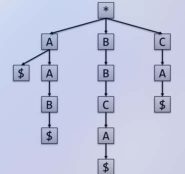

* A tree used typically to store strings and allows for efficient matching of patterns and implementing things like autocomplete
* **What to store for each node?**
    * We are going to "rule of zero" this, so no raw pointers.
    * Array of `unique_ptr`s to children (number of elements is alphabet size + 1; we will talk about the + 1 later)
    * `char` for the letter stored at the node
* **Trie template parameters**
    ```cpp
    template <size_t AlphabetSize, typename LetterToIdxFunc>
    class Trie
    ```
    * `AlphabetSize` - how many different letters are in the alphabet the trie needs to support (for space efficiency)
    * `LetterToIdxFunc` - maps a letter to a specific index in the array of children stored at each node
* **Example LetterToIdxFunc (alphabet size 3: A, B, C)**
    ```cpp
    struct BasicTextIdx {
        size_t operator()(char c) const {
            switch (c) {
                case 'A': return 0;
                case 'B': return 1;
                case 'C': return 2;
                default: return 0;
            }
        }
    };
    ```
* **What member data does the trie have?**
    * Pointer to root node
    * Instance of `LetterToIdxFunc` object
* *start/end*
    * `*`: start
    * `$`: end

### Insertion
* **Insert idea**
    * Get a string to insert; use existing nodes when appropriate or create new nodes if they don't already exist
    ```cpp
    void Insert(std::string_view word)
    ```
    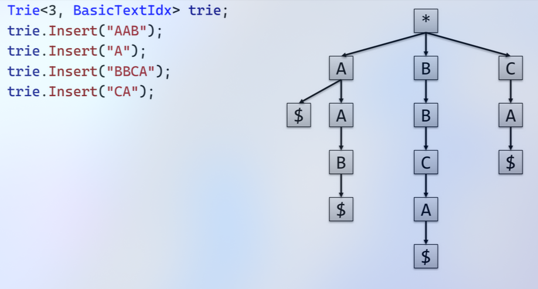

* **Breadth-First-Search traversal**
    * Not particularly useful on a trie, but helpful for writing test cases to ensure the trie is constructed to spec
    * Calls `visitFunc` on each node in the tree in a BFS manner, starting at root
    ```cpp
    void BFS(std::function<void(char)> visitFunc)
    ```
### FindPrefix
* Given a word, finds the longest prefix of that word which exists in the trie (or empty string if none)
```cpp
std::string FindPrefix(std::string_view word)
```
```cpp
Trie<26, EnglishTextIdx> t;
t.Insert("BAN");
t.Insert("BANANA");

t.FindPrefix("BANANAS");
// "BANANA"
```
* To implement efficiently, update the best option along the way during the search
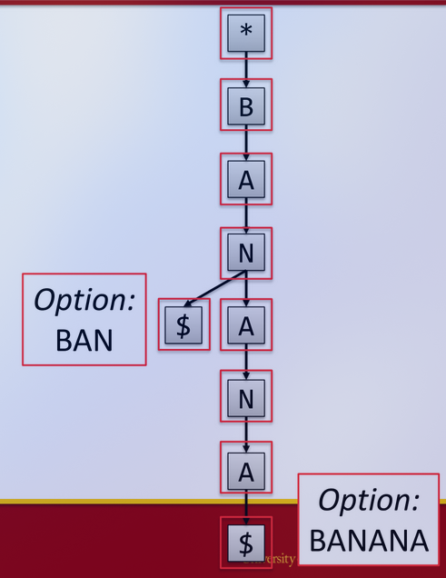

### CompleteFromPrefix
* Given a prefix, finds the X shortest words in the trie that match the prefix
```cpp
std::vector<std::string> CompleteFromPrefix(std::string_view prefix, size_t count = 3)
```
* How to reconstruct the words from the trie?
    * Option 1: During the BFS also save the partially-completed word in the queue, so you can just add the additional letter as it continues (fastest)
    * Option 2: Once you hit a `$`, traverse the parents back to root and reverse the word
        * *Not really possible anymore*
    
## DNA Pattern Matching
*Nucleotides: `A, T, C, & G`*

* Given a long DNA sequence, find the largest prefix in the trie that matches
* Start at letter 0 of the sequence, `FindPrefix`, then go on to letter 1, `FindPrefix`, etc
* Will use to find some transcription factor proteins

### FASTA File Format
* A simple, text-based file format used to describe (among other things) DNA nucleotide sequences
* First line has a comment/description of the file, and subsequent lines have a sequence of nucleotides
* Example:
    ```
    >gi|319999821:c124527448-124526573 Pan troglodytes isolate Yerkes chimp
    ATGATACCCATCCAACTCACTGTCTTCTTCATGATCATCTATGTGCTTGAGTCCTTGACAATTATTGTGCAG
    AGCAGCCTAATTGTTGCAGTGCTGGGCAGAGAATGGCTGCAAGTCAGAAGGCTGATGCCTGTGGACATGATT
    CTCATCAGCCTGGGCATCTCTCGCTTCTGTCTACAGTGGGCATCAATGCTGAACAATTTTTGCTCCTATTTT
    AATTTGAATTATGTACTTTGCAACTTAACAATCACCTGGGAATTTTTTAATATCCTTACATTCT
    ```

# Modern C++ Topics

## constexpr
* C++11 feature to allow compile-time computation
* Example:
```cpp
constexpr int max(int a, int b)
{
    return (a > b ? a : b);
}
```
* Then if we have code like this:
```cpp
constexpr int a = max(5, 6);
```
* The compiler will replace it with:
```cpp
int a = 6;
```
* Better example:
```cpp
constexpr int factorial(int x)
{
    if (x > 0)
    {
        return x * factorial(x - 1);
    }
    else
    {
        return 1;
    }
}
```
* This won't compile:
```cpp
struct Test
{
    static const int CONST_INT = 0;
    static const float CONST_FLOAT = 0.0f;
};
```
* Error: "A member of type const float cannot have an in-class initializer"
* Use `constexpr` instead:
```cpp
struct Test
{
    static constexpr int CONST_INT = 0;
    static constexpr float CONST_FLOAT = 0.0f;
};
```

## Filesystem
* Purpose: "implementations of an interface that computer programs written in the C++ programming language may use to perform operations on file systems and their components, such as paths, regular files, and directories."
* Gives us a cross-platform way for common file system operations like finding if a file exists, getting the size of files, iterating over files in directories, and more

### Checking if Files exist
```cpp
// Shortcut so we don't have to type out std::filesystem every time
namespace fs = std::filesystem;

// Get the size of a file (throws an exception if it doesn't exist)
try
{
    auto fileSize = fs::file_size("CMakeLists.txt");
    std::cout << "Size = " << fileSize << "\n";
}
catch (fs::filesystem_error& e)
{
    std::cout << "Error from filesystem: " << e.what() << "\n";
}
```

### No exceptions?
* If you don't want to use exceptions, most versions of filesystem functions have an alternative version that takes in an `error_code`
```cpp
std::error_code ec;
auto fileSize = fs::file_size("asdf", ec);

// A default error code means it's ok
if (ec == std::error_code{}) {
    std::cout << "Size = " << fileSize << "\n";
} else {
    std::cout << "Error: " << ec.message() << "\n";
}
```

### Path objects
* You can construct a path object to a single file, and extract information from it:
```cpp
fs::path pathTest("CMakeLists.txt");

// Does this file exist?
if (fs::exists(pathTest))
{
    std::cout << "File exists\n";
}
else
{
    std::cout << "File does not exist\n";
}
```

### Iterating over all files in a directory
```cpp
for (const auto& p : fs::directory_iterator(".")) {
    std::cout << p.path() << "\n";
}
```

## Optional, Variant, Any
*(Only Optional is really ever used)*

### std::optional
* An optional is a wrapper that can optionally contain a value
* You can use this for cases where you are not sure whether or not something would happen, for example:
```cpp
// This function will try to convert a string to an integer and either --
// Return the integer if successful
// Return an unset optional if not successful
std::optional<int> TryGetInt(const std::string& s) {
    try {
        int result = std::stoi(s);
        return std::optional<int>(result);
    } catch (std::exception&) {
        // stoi failed so return an unset optional
        return std::optional<int>();
    }
}
```
* You can pass around optionals to other functions, and the bool conversion operator will be true if it is set, false otherwise:
```cpp
void CoutOptional(const std::optional<int>& o) {
    if (o) {
        std::cout << o.value() << "\n";
    } else {
        std::cout << "Optional was unset!\n";
    }
}
```
* This code:
```cpp
auto result1 = TryGetInt("10");
CoutOptional(result1);
auto result2 = TryGetInt("xyzw");
CoutOptional(result2);
```
* Would output:
```
10
Optional was unset!
```

### std::variant
* sort of like a union
### std::any
* have any type

## Feature Testing (C++20 Later)
### Testing for features
* Need to include the `<version>` header
* Allows you to test, with the preprocessor, if a feature is supported, like:
```cpp
#if defined(__cpp_lib_filesystem)
// This code is compiled if the platform
// support std::filesystem
std::filesystem::path myPath("hello");
#endif
```

### Better way of checking for parallel algos
```cpp
#if !defined(__cpp_lib_parallel_algorithm)
#if defined(__APPLE__)
// On Apple platforms, we can use this if we have to
#define PSTLD_HEADER_ONLY
#define PSTLD_HACK_INTO_STD
#include "pstld.h"
#else
#error "Parallel algos are required"
#endif // defined(__APPLE__)
#else
#include <algorithm>
#include <execution>
#endif // !defined(__cpp_lib_parallel_algorithm)
```

* NOTE: *go over slides 22+ on Move Semantics*

# Exceptions and RTTI; The Preprocessor
*Week 5, Lecture 1, 02-09*
* You can disable exceptions in your compiler and stl implementations will continue on failure. *Technically not STL compliant*
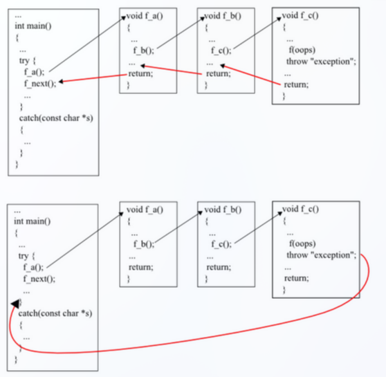

### What class type to throw?
* Never, ever, ever throw a class type whose constructor could also throw an exception
* Example:
```cpp
try
{
    throw std::string("BAD EXCEPTION HERE");
}
```
* What happens if string's constructor throws an exception?
* Answer: The program terminates

### std::exception
* Everything in the standard library throws an exception derived from `std::exception`, so you should also do this
```cpp
#include <exception>

class MyException : public virtual std::exception
{
    // what is a virtual function which returns a description
    const char* what() const noexcept override { return "MY EXCEPTION!"; }
};

// later on...
try
{
    throw MyException();
}
catch (std::exception& e)
{
    std::cout << e.what() << std::endl; // "MY EXCEPTION!"
}
```

### noexcept
* If you have a function that does not throw an exception back to the caller, specify `noexcept`
```cpp
// Default: Can throw anything
void Function1();

// Should not throw an exception
void Function2() noexcept;
```
* It is a guarantee to the caller that they do not have to worry about exceptions from this function
* NOTE: You have to specify `noexcept` on an override of `what`

### Exception-Safe Code
* If your code uses exceptions, you cannot guarantee that every function will reach a return statement
* Therefore, you cannot leave any dangling resources
* Example from Effective C++:
```cpp
void PrettyMenu::changeBackground(std::istream& imgSrc)
{
    lock(&mutex);
    delete bgImage;
    ++imageChanges;
    bgImage = new Image(imgSrc);
    unlock(&mutex);
}
```
* What happens if `new` throws an exception?
* Solution: use RAII

### RAII
* Resource Acquisition is Initialization
* Acquire the resource in the constructor, release in the destructor
```cpp
void PrettyMenu::changeBackground(std::istream& imgSrc)
{
    // Construct a LockGuard instead of just a function
    LockGuard lock(&mutex);
    delete bgImage;
    ++imageChanges;
    bgImage = new Image(imgSrc);
    // Not needed anymore, destructor of LockGuard does this
    // unlock(&mutex);
}
```
* Now regardless of how we exit changeBackground (normally, exception, etc), the unlock is guaranteed

### RTTI
* RTTI = Run-time Type Information (or Run-time Type Identification)
* In order for exceptions to work, C++ needs to figure out, at run-time, the type of the exception
* Thus, RTTI and exceptions sort of go hand in hand
* RTTI only works properly for classes that are polymorphic (e.g., have at least one virtual function, inherited or not)
* This is because RTTI information is stored in the virtual function table

#### dynamic_cast
* A down cast allows you to take a parent class pointer, and at runtime try to cast it to a child class
* Example: if you have a `Shape` pointer, and want to find out if it is a `Triangle` at runtime:
```cpp
Shape* myShape;
Triangle* myTriangle = dynamic_cast<Triangle*>(myShape);
if (myTriangle) // dynamic_cast returns 0 if not a triangle
{
    // do something
}
```
* Should only be used in cases where you have a function you do not want to expose in the base class, which is rare

#### typeid
* Allows you to figure out the type of something at runtime
```cpp
class Person
{
public:
    virtual ~Person() {}
};
class Employee : public Person
{
public:
};

// Later...
Person* ptr = new Employee();
if (typeid(*ptr) == typeid(Employee))
{
    // This is an employee!!
}
```

#### std::type_info
* The use of `typeid` returns a `std::type_info` class, which is defined in `<typeinfo>`
* Notable member functions:
    * `operator!=` (self-explanatory)
    * `operator==` (self-explanatory)
    * `name` (returns implementation-specific name, as a `const char*`)

#### Default RTTI Drawback
* Every single class with a virtual function has additional RTTI information stored in its virtual function table
* What happens if you have 10,000 classes with virtual functions, but you only need RTTI for 100 of them?
* Answer: Unnecessary memory waste
* Some C++ libraries (LLVM, for example) implement their own RTTI for this reason

### The Preprocessor
* Processes all `#` directives to generate the final C++ code which will be compiled
* The resulting code is often called a "translation unit"
* Example 1:
```cpp
#include "dbg_assert.h"
// dbg_assert.h code is essentially copy/pasted at this line
```
* Example 2:
```cpp
// Compile this only in a "debug" build
#ifdef _DEBUG
// Random debug code...
#endif
```
* Example 3:
```cpp
// Replaces "MAX_POOL_SIZE" with 256 in code
// (Breaks Rule #2 in Effective C++, use const instead)
#define MAX_POOL_SIZE 256
```

### Be careful with #include
* Don't make an "everything.h" that you include everywhere:
```cpp
// INCLUDE EVERYTHING
#include <algorithm>
#include <bitset>
#include <cassert>
#include <cctype>
#include <cerrno>
#include <cfloat>
// ...
```
* Only include files you really need to include

#### Include "Guard"
* May have seen this before:
```cpp
#ifndef _MYFILE_H_
#define _MYFILE_H_

// stuff here

#endif // _MYFILE_H_
```
* The above works, but a preferred method is to put this at the start of the header (works in Visual Studio, Clang, and GCC):
```cpp
#pragma once
```

#### Macros
* Not only can we define values like this:
```cpp
#define MY_VALUE 10
```
* We can replace one expression with another:
```cpp
#define max(a,b) (((a) > (b)) ? (a) : (b))
```
* So if you write code like this:
```cpp
std::cout << max(5, 6);
```
* Preprocessor replaces max with the defined code and our parameters:
```cpp
std::cout << (((5) > (6)) ? (5) : (6));
```
* Problem 2: must be very careful with parentheses
```cpp
#define MULT(x, y) x * y

// What if I do this?
int z = MULT(3 + 2, 4 + 2);
```
* Preprocessor evaluates it to:
```cpp
int z = 3 + 2 * 4 + 2;
```
* Instead, you need a lot of parentheses:
```cpp
#define MULT(x, y) ((x) * (y))
```
* So the preprocessor gives you:
```cpp
int z = ((3 + 2) * (4 + 2));
```
* Preprocessor trick - stringify
    * You can convert any token passed to the preprocessor to a string using `#` in front of the parameter name
```cpp
#include <iostream>

#define TO_STRING(str) #str

int main() {
    std::cout << TO_STRING(10 + 5) << std::endl;
    return 0;
}
```

# Functional Programming; Threads
*Week 5, Lecture 2, 02-11*
*Not on midterm, is on PA4*
* **Imperative Language** is a language that does not have any classes.
    * *C, Fortran*
* **Functional** use fnuctions for everything.
    * *Haskell, Ocaml, LISP*
* ***C++*** *is crossover between imperative and OOP. Because you don't NEED to use classes but just use templates.*
    * *With the additional of lambdas in std11 its arguably also a functional language.*
* ***note: whenever using a lambda if you capture [this] make sure that the this object outlives the lambda to avoid undefined behavior.***

## Functional Programming
* Functions are **First class citizens**
    * Passed as argument to other functions
    * Returned from other functions
    * Can be assigned to a variable or stored in a container
    * ***C++ Lambda satisfy these criteria***

* In functional programming, *higher-order functions* - functions that can accept other functions as arguments - are allowed
* Three very common higher-order functions:
    * **map** - apply a function to each element in a collection, storing the result in another collection
    * **filter** - remove elements from a collection based on a filtering function
    * **reduce** - reduce a collection to a single value by applying a binary operation repeatedly
* All three of these higher-order functions are more or less supported in C++, though they have different names

* Generally, functional programming tries to largely limit *side effects* - having any interaction with the world "outside" from the instance of a function call
* Examples of side effects:
    * Modifying data passed into the function (e.g., pass-by-reference where you change the values)
    * Modifying global or static data
    * **Any I/O** (*can be hard to realistically enforce*)

* Functional programs should generally be stateless - in a practical sense, this means no globals, statics, etc
* All functions should accept at least one argument
* All functions must return data or another function - no void functions
* Avoid loops/iteration - always use recursion or higher-order functions. Some functional programming languages do not have any iteration at all

### Average a Vector - An Example
```cpp
// Imperative-style implementation
float averageVector(const std::vector<float>& v) {
    float sum = 0.0f;
    for (auto& i : v) {
        sum += i;
    }

    return sum / v.size();
}
```

### Average a Vector, Cont'd
* To follow the principles of functional programming, the loop go...
```cpp
float averageVector(const std::vector<float>& v) {
    float sum = 0.0f;
    for (auto& i : v) {
        sum += i;
    }

    return sum / v.size();
}
```

### Functional Decomposition
* *Functional decomposition* is a fancy way of saying "break a function into sub functions"
* Let's make an average function that computes the average given a sum and a quantity:
```cpp
float average(float sum, size_t qty) {
    return sum / qty;
}
```

### Reduce
* *reduce* - take a collection and reduce it to a single value by applying a binary operator repeatedly
* *We want to reduce the collection to the sum of its components!*
* In C++, reduce can be implemented via `std::accumulate` in the `<numeric>` header

### Sum Vector
```cpp
float sumVector(const std::vector<float>& v) {
    // std::accumulate can work as a REDUCE
    return std::accumulate(v.begin(), // Start of range
                           v.end(),   // End of range
                           0.0f,      // Initial value
                           // Binary lambda expression
                           [](const float& a, const float& b) {
                               return a + b;
                           });
}
```
* Note: default `std::accumulate` already uses `a + b`, so the custom lambda is not necessary

### Putting it Together
```cpp
// Functional implementation
float average(float sum, size_t qty) {
    return sum / qty;
}

float sumVector(const std::vector<float>& v) {
    return std::accumulate(v.begin(), v.end(), 0.0f);
}

float averageVector(const std::vector<float>& v) {
    return average(sumVector(v), v.size());
}
```

### all_of, any_of, none_of - A lambda usage case
* A series of new functions in C++11 in `<algorithm>`
* Given a range of values and a unary predicate with this signature:
```cpp
bool predicate(const T& a);
```
* It will return true if *all_of*, *any_of*, or *none_of* the elements satisfy the condition

### all_of Example
```cpp
std::vector<int> v1{ 2, 4, 6, 8, 10 };
if (std::all_of(v1.begin(), v1.end(), [](const int& i) {
    return (i % 2) == 0;
}))
{
    std::cout << "All are even!" << std::endl;
}
else
{
    std::cout << "All aren't even" << std::endl;
}
```

### copy_if - Another Example
```cpp
std::vector<int> from{ 1, 2, 3, 4, 5 };
std::vector<int> to;

auto is_odd = [](const int& i) { return i % 2 == 1 }; 

// Copy from the "from" container into the "to" container,
// only if is_odd returns true for that element
std::copy_if(from.begin(), from.end(),
             std::back_inserter(to), is_odd);
```

### copy_n
* Copies n elements from a source collection to a back_inserted collection

### Map
* The *map* higher-order function applies a function to each element, saving the results in a different collection
* It can be approximated by the `std::transform` function:
```cpp
std::vector<float> divEachBy(const std::vector<float>& v, float denominator) {
    std::vector<float> ret;
    // std::transform can be used to map
    std::transform(v.begin(),   // Start of range
                   v.end(),     // End of range
                   std::back_inserter(ret), // Collection to insert into
                   // Unary function that returns transform value
                   [denominator](const float& a) {
                       return a / denominator;
                   });
    return ret;
}
```

### Write our own "map" function?
```cpp
template <typename T, typename U>
T map(const T& v, U f) {
    T ret;
    std::transform(v.begin(), v.end(),
                   std::back_inserter(ret), f);
    return ret;
}
```
* (Aside: This is an example of where using `namespace std` may not be good)

### Filter
* The *filter* higher-order function removes elements based on a Boolean filter condition
* We could write this higher-order function, too:
```cpp
template <typename T, typename U>
T filter(const T& v, U f) {
    T ret;
    std::copy_if(v.begin(),  // Start of range
                 v.end(),    // End of range
                 std::back_inserter(ret), // Where to insert
                 f); // Boolean unary function
    return ret;
}
```

### Filter in Action
```cpp
std::list<int> filterIsPositive(const std::list<int>& l) {
    return filter(l, [](const int& a) {
        return a > 0;
    });
}
```

### Generate
* Helper that can be used to insert elements into a collection, where elements need to be initialized with a particular function
```cpp
// Make a vector w/ 10 elements
std::vector<int> v(10);
std::generate(v.begin(),  // start of range
              v.end(),    // end of range
              // Lambda that returns generated value
              []() {
                  return rand();
              });
```

### adjacent_difference
```cpp
std::vector<int> from({ 10, 15, 20, 25, 30, 35 });
std::vector<int> to;

std::adjacent_difference(from.begin(), // Start of range
                         from.end(),   // End of range
                         std::back_inserter(to), // Collection to insert into
                         // Lambda to compute difference (defaults to subtraction)
                         [](int a, int b) {
                             return a - b;
                         });
```
* The first element in the resulting range is a copy; the rest of the collection is differences (index 1 - index 0 of the source is stored in index 1 of the destination, and so on)
* This subtracts `idx - 1` from `idx` for each element
* So in the above, `to` will contain: `{ 10, 5, 5, 5, 5, 5 }`

## Threads Basics

### Process
* A computer program:
    * A passive collection of instructions typically stored in a file on disk
* A process is a program in execution
    * **Allocated memory** (heap, stack, code)
    * **OS descriptors** of resources that are allocated to the process: such as file descriptors
    * **Security attributes**, such as the process owner and the process' set of permissions
    * **Processor state** (context), such as the content of registers and physical memory addressing
* Several processes may be associated with the same program
    * Multiple instances of a program running at the same time

### Thread
* The smallest sequence of instructions that can be managed independently by a OS
* Multiple threads can exist within one process
    * Can execute concurrently and sharing resources such as memory, while different processes do not share these resources
* Threads of a process share
    * Code
    * Memory (Global variables, heap)

### std::thread - Create Threads Using Function Pointers

#### Calculating the sum
* Calculating the sum of numbers in the range `[start, end)`
```cpp
void AccumulateRange(uint64_t &sum, uint64_t start, uint64_t end) {
    sum = 0;
    for (uint64_t i = start; i < end; i++) {
        sum += i;
    }
}
```

#### Calculating the sum (two threads)
* Two threads each working on half of the range
* `total = partial_sum[0] + partial_sum[1]`

#### Pointer to Function
```cpp
std::thread t1(AccumulateRange,
               std::ref(partial_sums[0]), 0, 1000 / 2);
```

#### Use std::ref to pass by reference
* All parameters are passed by value; use `std::ref` to pass by reference
* `std::ref` wraps the argument in a `std::reference_wrapper` so `std::thread` stores a reference instead of copying the value
* Use `std::ref` instead of `&` because `std::thread` copies arguments into its internal storage; a raw `&` would pass a pointer and change the function signature, while `std::ref` keeps the same reference parameter type

### Joining Threads
* Create and start each thread
* Wait for threads to end with `join`
```cpp
std::thread t1(AccumulateRange, std::ref(partial_sums[0]), 0, step);
std::thread t2(AccumulateRange, std::ref(partial_sums[1]), step, number_of_threads * step);

t1.join();
t2.join();
```

### std::thread - Create Threads Using Lambda Functions

#### What's a lambda?
* **Reminder:** Lambda function is a function definition that is not bound to an identifier
```cpp
[capture](parameters) -> return_type { function_body }
```
```cpp
[](int x, int y) -> int { return x + y; }
```
```cpp
std::vector<int> some_list{ 1, 2, 3, 4, 5 };
int total = 0;
std::for_each(begin(some_list), end(some_list),
              [&total](int x) { total += x; });
```

#### Using lambdas
* Calculating the sum of numbers in the range `[start, end)`
```cpp
[i, &partial_sums, step] {
    for (uint64_t j = i * step; j < (i + 1) * step; j++) {
        partial_sums[i] += j;
    }
}
```
```cpp
for (uint64_t i = 0; i < number_of_threads; i++) {
    threads.push_back(std::thread([i, &partial_sums, step] {
        for (uint64_t j = i * step; j < (i + 1) * step; j++) {
            partial_sums[i] += j;
        }
    }));
}
```

#### Using lambdas (overview)
* Vector of threads
* Vector of sums
* Create, start, and push each thread into a vector
* Wait for threads to end
* Calculate total sum

#### Using lambdas - takeaway
* As an alternative to passing a parameter, we can pass references to lambda functions using **lambda capture**

### std::async - Task, Futures, and Promises

#### Async - pointer to function
```cpp
uint64_t GetRangeSum(uint64_t start, uint64_t end) {
    uint64_t sum = 0;
    for (uint64_t i = start; i < end; i++) {
        sum += i;
    }
    return sum;
}

auto t = std::async(GetRangeSum, 0, 100 / 2);
auto return_value = t.get();
```
* `std::async` returns a **future** (similar to a JS Promise)
* `t.get()` blocks until the task finishes; do other work first and call `get()` when you need the result

#### Async - tasks in a vector
```cpp
std::vector<std::future<uint64_t>> tasks;

for (uint64_t i = 0; i < number_of_threads; i++) {
    tasks.push_back(std::async(GetRangeSum, i * step, (i + 1) * step));
}

uint64_t total = 0;
for (auto& t : tasks) {
    total += t.get();
}
```
* Create, start, and push each task into a vector
* Wait for tasks to end and read return values

#### std::launch policy
* `std::async` can take one more parameter of type `std::launch`:
    * `std::launch::async`: the function will run on its own (new) thread
    * `std::launch::deferred`: the function call will be deferred until either `wait()` or `get()` is called on the future
    * `std::launch::async | std::launch::deferred`: the implementation may choose (default)
```cpp
auto t = std::async(policy, GetRangeSum, 0, 100 / 2);
```

# Genetic Algorithms
*Week 6, Lecture 1, 02-18*
## PA4
* Traveling Salesman
    * *Given LAX + 19 Diff locations in LA/
    * Find the shortest path that starts at LAX, visits each other location once, and returns to LAX.
    * Assume you can use a helicopter because roads add complexity*
* While there are more efficient algorithms, they still are extremely slow (non-polynomial time)
* Instead use a *heuristic algorithm* - try to find a solution that we think is pretty good (but cannot prove how good it is)
* A *genetic algorithm* (GA) is one type of heuristic algorithm
* Takes the idea of Darwinism and applies it as a heuristic algorithm
* Roughly, we start with some guesses and try to pick the "fittest" guesses to evolve into better guesses
* After enough iterations, we stop and have a pretty good solution

### When are GAs a good option?
* You have a problem where you want the "best possible" solution
* There is no known efficient algorithm to find the optimal solution
* You can quantify how good or bad a solution is
* You have a way to combine parts of two (or more) solutions

## Genetic Algorithm Cycle
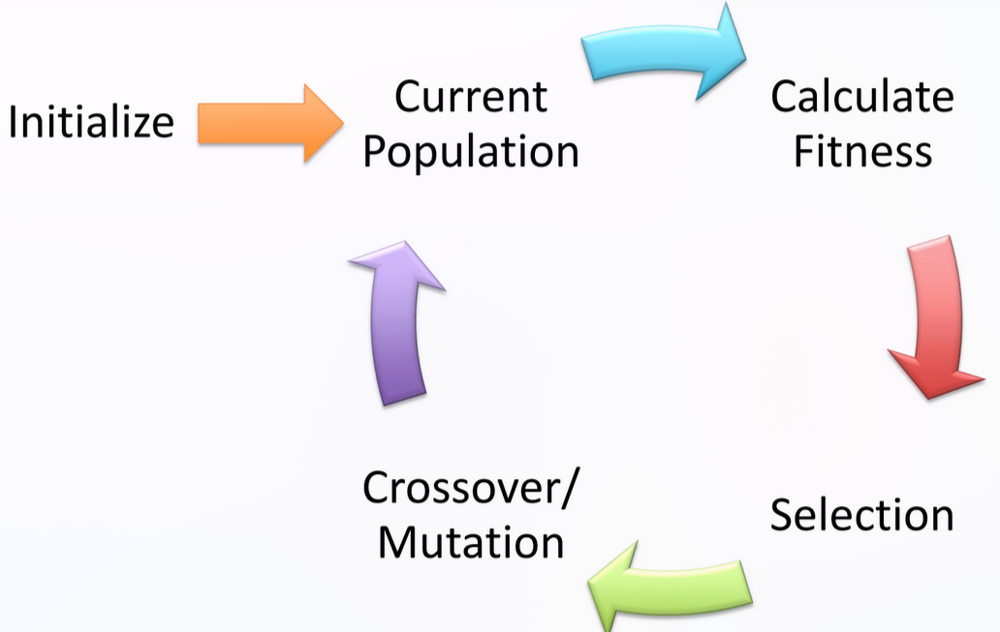

### Initialize GA
* Generate a random initial population
* Ideally want a simple representation of each member (text "genomes" are popular, but not the only way)
* Size of population varies (for us, a command line argument)

### Our Population "Genome" Representation
* A vector of numbers corresponding to the index of the location (the first location in the file is 0)
* So this...
    * 0 5 3 2 1 4
* Means first start at location 0, then go to 5, then go to 3, then go to 2, then go to 1, then go to 4, then return to 0 (implied)

* ***For us, we start/end at location 0 (LAX)***

### Sample Initial Population (Size = 8)
* Example populations:
    * 0: 0 5 3 2 1 4
    * 1: 0 2 4 5 3 1
    * 2: 3 5 2 4 0 1
    * 3: 1 3 2 4 5 0
    * 4: 5 4 0 2 1 3
    * 5: 5 2 0 1 4 3
    * 6: 5 0 2 4 3 1
    * 7: 0 1 3 2 4 5
* *Note:* In this case, we assume the tour can start at any location. In our "traveling Trojan" problem we will always start at location 0

### Calculate Fitness
* For us, "more fit" = shorter distance = better.
* We can use std::accumulate
    * Make sure to account the distance from last to first (wrap aronud)

* For fitness, we use the *Haversine distance* formula to compute the distance of each segment on the path:
```
dlon = lon2 - lon1
dlat = lat2 - lat1
a = (sin(dlat/2))^2 + cos(lat1) * cos(lat2) * (sin(dlon/2))^2
c = 2 * atan2( sqrt(a), sqrt(1-a) )
distance = 3961 * c
```
* Once we have the segment distances, sum them together for the total tour distance
* **PA Note:** You have to convert the numbers in the input file from degrees to radians. To convert, multiply by 0.0174533
* *In this case, population member #3 is the fitttest (shortest tour)*

### Selection
* Based on fitness rankings, select pairs of individuals to reproduce
* Should give some (but not all) preference to fitter individuals
* Select number of pairs = population size for pairwise reproduction
* Many ways to do this; slides describe what we use in the PA

### Sample Selection Probabilities
* Step 1: Sort population member #s by fitness (smallest to largest)
    * Example order: 3, 0, 2, 1, 5, 4, 6, 7
* Step 2.a: Give each member the same probability (1/popSize)
* Step 2.b: Multiply the two fittest by 6 (the 6 is an arbitrary magic number)
* Step 2.c: Multiply the remainder of the top half, not including the top two, by 3 (3 is a magic number)
* Step 2.d: Renormalize the probabilities (sum them and divide by sum)
    * sum = 22/8
    * final probabilities: 6/22, 6/22, 3/22, 3/22, then 1/22 for each of the rest

### Sample Selecting Pairs
* Step 3: Assign the range of [0,1] to the different population members, based on probabilities
* Step 4: Generate two random doubles in the range [0,1] to figure out two parents
    * Example random doubles = (0.40, 0.68) -> parent pair = (1, 3)
* Step 5: Repeat step 4 for however many pairs you want (in our case, popSize)
    * Example pairs: (1, 3), (2, 1), (0, 3), (4, 1), (3, 5), (3, 7), (3, 3), (2, 3)

### Our Selection Process
* Generate the pairs as follows:
    1. Sort the population by fitness
    2. Distribute probability as follows:
        a. Give each member the same probability (1/popSize)
        b. Multiply the two fittest by 6
        c. Multiply the remainder of the top half, not including the top two, by 3
        d. Renormalize the probabilities
    3. Assign the range of [0,1] to the different population members, based on probabilities
    4. Generate two random doubles in the range [0,1] to figure out two parents
    5. Repeat step 4 for however many pairs you want (in our case, popSize)

### Why not only select fittest?
* We want to avoid rapid genetic drift

### Genetic Drift = Bad
* Genetic drift means we quickly converge on a solution
* However, there is no guarantee the solution is globally optimal - it could be locally optimal (classic "hill climbing" problem)
    

### Crossover/Mutation
* Reproduce selected pairs by "crossing over" the genomes
* Might also introduce random mutations (as in real genetics)

### Crossover Example
* Select whether parent A or B goes first
    * For this example: A
* Select a crossover index from 1 to size - 2
    * For this example: 2
* We selected A goes first, and 2 is the crossover index
    * Copy from A [0...2]
    * A: 0 5 3 2 1 4
    * B: 0 4 3 5 1 2
    * Child: 0 5 3 _ _ _
* Since B goes second, copy any locations from B that are not already in the child (in order)
    * Child: 0 5 3 4 1 2

### Mutations
* We'll just use a simple mutation implementation:
* There's a chance a mutation occurs when creating a child
* If we mutate, pick two random indices (not including index 0), and swap the values

### Crossover Summary
1. Generate a random crossover index value from [1, size - 2]
2. "Flip a coin" to decide which parent should go first
3. Selected first parent will copy all elements from beginning up to and including crossover index into child
4. Second parent will start at the beginning, and copy over all elements that don't already appear in the child
5. Mutate, based on probability

### Repeat
* Keep repeating until reaching a condition of termination
* In our case, number of generations is specified as a command line argument

### Convergence in our case
* Eventually, we end up with a population with very similar members

## Random Numbers in Modern C++

### C++11 Random
* The original `rand()` is *implementation-defined*, which means:
    * Not portable
    * May not be thread-safe
    * May not be a great random number generator
    * Code like `rand() % num` is not a great way to guarantee a specific type of distribution
        * One value may be 5% higher than another for example

* In C++11 there is now a standardized library in `<random>`:
    * Defines a set of random number generators with specific implementations
        * *Gauranteed on diff platforms*
    * Defines specific ways to extract randomized distributions (uniform, Gaussian, etc.)
        * *May be different between platforms*

### C++11 Random, Basics
* First, declare an instance of a generator
* We are using the Mersenne Twister PRNG:
```cpp
std::mt19937 randGen(seed);
```
* In our case, the seed value will be a command line parameter. This is to guarantee your results will match my results
* **PA Note:** You must make sure you generate random numbers where the instructions tell you to, or you will get different results

### C++11 Random, Distribution
* First declare the distribution
* Then when you want to use it, you call it like a function, passing in the random number generator:
```cpp
// Pick a random value from [0, 10]
std::uniform_int_distribution<int> myDist(0, 10);
int index1 = myDist(randGen);
```

# Exam Review Notes
*Week 7, Lecture 1, 02-23*
* Q1
    * Two criteria for an ellision to happen:
        1. Unnamed return value
        2. Caller uses in constructor (not assignment)
    * `z = func(y)`
        * It is not ellided because Z is already an object constructed when we procede to function(y).
    * ***Note: Assignments happen on objects previously made. Otherwise "=" on the same line is a constructor.***
    * *Review what happens when we remove the flag*
    * *Do we implement rule of 5 only when we enable this flag?*
* **Move Constructor** `T(T&& src))`
    * `this` is uninitialized
    1. steal pointers/data from src
    2. null/zero src
* **Move Assignment** `T& operator=(T&& src))`
    * `this` is is already something
    1. if this == &src, return \*this
    2. release everything from '\*this', we don't care anymore
    3. steal from src
    4. put src into valid empty state / nullptrs
    3. null/zero src
* ***moves should always be marked noexcept***

# PA5 Notes; Templates
*Week 8, Lecture 1, 03-02*

### PA5
* You will implement a "virtual machine"/"emulator" for the classic ITP-11 computer system with the Turtle Processing Unit
* Features of this advanced system include:
    * Fifteen 32-bit integer registers
    * 1 KB of stack space
    * 3-bit color graphics (eight total colors!!!)

### PA5 - Why?
* Be the machine
* We can use template metaprograms, exceptions, some other C++ features
* It's fun

### Parsing Input file
* The input files contain one or more commands, like this:
```
movi tx,110
movi ty,105
movi tc,1
pendown
mov r7,r0
movi r6,5
movi r1,100
movi r2,144
fwd r1
add tr,tr,r2
inc tc
inc r7
cmplt r7,r6
movi r5,6
jt r5
exit
```

### Parsing Input file (params)
* Some take no parameters
* Some take a single parameter
* Some take a comma-separated list of parameters
* Some parameters are integers, some are strings (register names)

### Doing this without template metaprograms
* We'd first declare a base class for all ops:
```cpp
struct Op
{
    virtual const char* GetName() const = 0;
    virtual void Parse(const std::string& params) = 0;
    virtual void Execute(class Machine& machine) = 0;
};
```

### Doing this without template metaprograms (example op)
* Then maybe make a subclass for each op, like:
```cpp
// movi reg1,int
// reg1 = int
struct MovI : Op {
    const char* GetName() const override { return "movi"; }
    void Parse(const std::string& params) override {
        // Split comma-separated list
        std::vector<std::string> paramV = Split(params);
        opReg1 = paramV[0]; // This is a string
        opInt = std::stoi(paramV[1]); // Gotta convert this to int!
    }
    void Execute(class Machine& machine) override
    { /* Do whatever */ }
    // Member data for this op!
    std::string opReg1;
    int opInt;
};
```

### Doing this without template metaprograms (repeat)
* Now repeat writing that parse function, and specifying member data for each of the 20+ different ops!
* I say... NOPE. Not today...

### We have a pattern
* Every op takes in a comma-separated list of 0 or more params
* We need member data to store each param with the correct type
* We want to convert each param to the desired type (if needed)

### We have a pattern (continued)
* We want to define this pattern, and *make the compiler generate* the correct member data/parsing code for each op

### Basic Template Syntax (classes)
```cpp
template <typename T>
class List
{
    // ...
};
```

### Basic Template Syntax (functions)
```cpp
template <typename T>
T max(T a, T b)
{
    return ((a > b) ? a : b);
}
```

### Compiler Instantiation
* If you use this template in code as such:
    * `max(1, 2);` // Type not specified, compiler attempts substitution
    * `max<char>('a', 'b');` // Type specified (optional)
* Compiler will instantiate two versions of our function:
```cpp
int max(int a, int b)
{
    return ((a > b) ? a : b);
}

char max(char a, char b)
{
    return ((a > b) ? a : b);
}
```

### Template Specialization
* Suppose you want to do something specific in max when the type is std::string (kinda weird in this example)
* You can then specify a specialization:
```cpp
template <>
std::string max<std::string>(std::string a, std::string b)
{
    // Code specific for this case
}
```

#### Fibonacci Example
```cpp
//recursive case
template <unsigned N>
struct FibT
{
    static const unsigned Value = FibT<N-2>::Value + FibT<N-1>::Value;
};

//base cases:
template <>
struct FibT<0>
{
    static const unsigned Value = 0;
};
template <>
struct FibT<1>
{
    static const unsigned Value = 1;
};
```

#### Compiler Tip
```cpp
max<int>(10, 5) -> max(10, 5)
max(10, 5.0) //wont compile because type T ambigious int or double 
max<int>(10, 5.0) OR max(10, (int)5.0);
```

### std::tuple
* Tuples are like std::pair, except they can have zero to infinite members
* You can use the terminology like this:
    * 0-tuple = Empty
    * 1-tuple = Has one element
    * 2-tuple = Has two elements (it's a pair)
    * 3-tuple = Has three elements
    * ...

### An empty tuple
* Although it seems weird, you can declare 0-tuple if your heart desires
```cpp
std::tuple<> empty;
```

### A 3-tuple example
* This example is more useful
```cpp
// This has three members (an int, a char, and a float)
std::tuple<int, char, float> tuple3;

// Once constructed, use std::get<idx>
// to access a member of the tuple
// (Both for setting and getting the value)
std::get<0>(tuple3) = 50; // Set int member
char c = std::get<1>(tuple3); // Get char member

// The index passed to get MUST BE CONSTANT AT COMPILE TIME!!!
```

### std::make_tuple
* If I want to save typing and know what values I want to construct for my tuple, I can use make_tuple:
```cpp
auto myTuple = std::make_tuple(50, "Hello", 10.0);
// myTuple has
// 0 - An int (50)
// 1 - A const char* pointing to "Hello"
// 2 - A double (10.0)
```

### std::tuple_cat
* Given 0 or more tuples, constructs a tuple concatenating the tuples together
```cpp
auto myTuple = std::make_tuple(1337);
auto otherTuple = std::make_tuple(std::string("Yo!"));

auto cat = std::tuple_cat(myTuple, otherTuple);
// cat has
// 0 - An int (1337)
// 1 - A std::string containing "Yo!"
```

### The first insight
* We want to convert the input comma-separated string into a tuple of the correct types
* This is easier said than done
* We need to know the tuple types at compile time
* So, we have to generate types through template magics based on the expected parameters

### The ground floor
* Given an input string of a single element, we want to be able to convert it to a 1-tuple of the expected type
* Here is the generic template version... note I make it uncompilable by not actually returning anything
```cpp
// Generic version of ParseElem
// If this generic version is instantiated, it won't compile
template <typename T>
std::tuple<T> ParseElem(const std::string& elem)
{
}
```
* ***We make this template (which is uncompilable) as a base class for specializations we will actually make.***

### ParseElem specializations
* Next, I make specializations that convert string to tuple<int> or to tuple<string>
```cpp
// Specialization of ParseElem<int>
// Converts elem to a tuple{int}
template <>
inline std::tuple<int> ParseElem<int>(const std::string& elem) {
    return std::make_tuple(std::stoi(elem));
}

// Specialization of ParseElem<std::string>
// Just makes a tuple{str} from elem
template <>
inline std::tuple<std::string> ParseElem<std::string>(const std::string& elem) {
    return std::make_tuple(elem);
}
```
* ***Templates are a special case where we need to use inline because their normal functions and it will break for the same reason normal functions will break on header file multiple include.
* note: Functions in classes that have the body implemented are implicitly inline functions technically.

### How would I use ParseElem?
```cpp
// This will give us a tuple<int>
auto a = ParseElem<int>("11");

// This will give us a tuple<string>
auto b = ParseElem<std::string>("r1");

// This won't compile
auto c = ParseElem<double>("50.0");
```

### ParseStr - The secret sauce begins
* Now we declare a function called ParseStr that:
    * Has 0 or more template parameter types
    * Returns a tuple corresponding to the 0 or more template types
    * Takes in a vector of strings (the different parameter strings)
```cpp
template <typename... Args>
std::tuple<Args...> ParseStr(std::vector<std::string>& paramV);
```
* The ... syntax is a *variadic template*, a template that takes in zero or more types
* Notice how we can directly pass that list of types into the template parameter of std::tuple

### ParseStr - Specialization for zero types
* We make a specialization for where there are no types passed to the template:
```cpp
template <>
inline std::tuple<> ParseStr<>(std::vector<std::string>& paramV)
{
    return std::make_tuple();
}
```
* This is going to serve as a "base case"

### ParseStrHelper - Declaration
* Declare ParseStrHelper, which has these template params:
    * A single type `T`
    * Zero or more additional types `Args`
```cpp
template <typename T, typename... Args>
std::tuple<T, Args...> ParseStrHelper(std::vector<std::string>& paramV)
```
* Notice how again, we forward the types in that order to the tuple
* Using this pattern allows us to separate the first type in the template parameters from the remainder
* We want to convert the first type with ParseElem and forward the remaining to a recursive call of ParseStr

### ParseStrHelper - Implementation
```cpp
template <typename T, typename... Args>
std::tuple<T, Args...> ParseStrHelper(std::vector<std::string>& paramV)
{
    // Get the last string from the vector
    // This assumes paramV is in reverse
    std::string elem = paramV.back();
    paramV.pop_back();

    // ParseElem<T>(elem) takes elem and converts it into a tuple{T},
    // then take the remaining elements in paramV, and pass
    // it to ParseStr for the remaining variadic types (Args...)
    // (This is the recursive step)
    //
    // Concatenate these tuples with tuple_cat
    return std::tuple_cat(ParseElem<T>(elem),
                          ParseStr<Args...>(paramV));
}
```

### ParseStr - Generic implementation
* All ParseStr does is forwards the arguments to ParseStrHelper
* You need this extra indirection so ParseStrHelper can separate the first type from the rest
```cpp
template <typename... Args>
std::tuple<Args...> ParseStr(std::vector<std::string>& paramV)
{
    return ParseStrHelper<Args...>(paramV);
}
```

### ParseStr in action
* Suppose I have this code:
```cpp
std::vector<std::string> paramV = {"5", "r1"};
auto t = ParseStr<std::string, int>(paramV);
```

### ParseStr in action (instantiation)
* At compile time, the compiler has to "instantiate" all the templates we just declared, starting from the top:
    * ParseStr<Args={std::string, int}>
        * ParseStrHelper<T=std::string, Args={int}>
            * ParseElem<T=std::string>
            * ParseStr<Args={int}>
                * ParseStrHelper<T=int, Args={}>
                    * ParseElem<T=int>
                    * ParseStr<Args={}>

### ParseStr in action (type)
* This means the type of `t` is:
```
std::tuple<std::string, int>
```

### ParseStr in action (results)
* After executing this code:
    * `std::get<0>` gives me a string with "r1"
    * `std::get<1>` gives me an int with 5
* It's in reverse, but that's intentional

### Back to Ops, Back to Reality
* So how do we leverage this for the ops?
```cpp
template <typename... Args>
struct OpBase : Op
{
    void Parse(const std::string& params) override
    {
        // Split
        std::vector<std::string> paramV = Split(params);
        // Reverse vector for simplicity of template metaprogram
        std::reverse(paramV.begin(), paramV.end());
        // Generate the tuple
        mParameters = ParseStr<Args...>(paramV);
    }

    // Tuple to hold op arguments
    std::tuple<Args...> mParameters;
};
```

### MovI
* Now declare the op as a subclass of OpBase with the correct template parameters:
```cpp
// movi reg1,int
// reg1 = int
struct MovI : OpBase<std::string, int>
{
    const char* GetName() const override { return "movi"; }
    void Execute(class Machine& machine) override
    { /* Still have to implement this */ }
};
```

### MovI (meaning)
* This means that...
    * MovI will have an mParameters tuple with:
        * 0 - String name of register
        * 1 - Integer value to store in register
* The correct Parse function is automatically generated for you by the template metaprogram

### Constructing the Correct Op Subclass
```cpp
// Open the file
while (/* Not eof */) {
    // Get the string for op name and params
    std::string opName = /*blah*/;
    std::string params = /*blahblah*/;
    std::shared_ptr<Op> ptr;
    if (opName == "movi") {
        ptr = std::make_shared<MovI>();
    } else if (opName == "exit") {
        ptr = std::make_shared<Exit>();
    } else if (opName == "add") {
        ptr = std::make_shared<Add>();
    }
    // Yikes.........
    // ..........
    ptr->Parse(params);
}
```

### We have a pattern (op construction)
* Given a string corresponding to the op, we want to construct a shared pointer to the correct type
* We want a map where:
    * Key is string name of op
    * Value is a "factory method"/"creator function" that knows how to construct said type

### The CreateOp template function
* All it does is calls make_shared on the desired op subclass T
```cpp
template <typename T>
std::shared_ptr<Op> CreateOp()
{
    return std::make_shared<T>();
}
```
* (This has to be a standalone or static function)

### Now let's declare our map
```cpp
std::map<std::string,
         std::function<std::shared_ptr<Op>()>>
    opMap;
```
* The key type is std::string (name of op)
* The value type is a function that takes in no parameters and returns a std::shared_ptr<Op>

### Add Elements to the Map
```cpp
opMap.emplace("movi", &CreateOp<MovI>);
```
* This says that for "movi" call CreateOp<MovI>

### Now with the map
* Look how simple our code is
```cpp
while (/* Not eof */) {
    // Get the string for op name and params
    std::string opName = /*blah*/;
    std::string params = /*blahblah*/;

    // Look up the opName in our map, and call the
    // correct CreateOp function! (note the extra
    // parenthesis at the end, that's the function call)
    std::shared_ptr<Op> ptr = opMap.at(opName)();
    ptr->Parse(params);
}
```

### And Just For Fun...

### For more fun...
* We can meta-metaprogram via the power of X-macros, you could also generate those map entries
* You could even use X-macros to auto-generate all the OpBase subclass declarations

### If we want to X-Macro...
* Make a Ops.def file, like:
```cpp
// Define all the ops our VM supports, along with parameters
// Syntax: OP(textName, className, args...)
OP(exit, Exit)
OP(movi, MovI, std::string, int)
OP(add, Add, std::string, std::string, std::string)
OP(mov, Mov, std::string, std::string)
// ...
```

### To declare the Op subclasses
```cpp
// Define version of OP macro that creates declaration
// __VA_ARGS__ is an expansion of variadic arguments
#define OP(textName, className,...) \
struct className : OpBase<__VA_ARGS__> \
{ \
    const char* GetName() const override { return #textName; } \
    void Execute(class Machine& machine) override; \
};

// This will take definitions and apply OP macro to each
#include "Ops.def"

// Undefine the OP macro
#undef OP
```

### To declare the opMap
```cpp
// This macro converts a single OP definition to the appropriate
// {key,value} pair entry in the map
#define OP(textName, className,...) { #textName, &CreateOp<className> },

std::map<std::string, std::function<std::shared_ptr<Op>()>> opMap =
{
    #include "Ops.def"
};

#undef OP
```

### Should we do this?
* We can do this, but *should* we?
* It may make our code more difficult to follow, debug, and our fellow developers may hate us
* But it still is a cool trick to have up your sleeve for special occasions!

# More Templates
*Week 8, Lecture 2, 03-04*

### This vector default constructor is wrong
```cpp
template <typename T>
class Vector {
public:
    // Default constructor allocates to capacity
    Vector()
    : mCapacity(20)
    , mSize(0)
    , mData(new T[mCapacity])
    { }

    void push_back(const T& e) {
        if (mSize >= mCapacity) {
            // Grow vector...
        }

        mData[mSize] = e;
        mSize++;
    }

    ~Vector() {
        delete[] mData;
        mCapacity = 0;
        mSize = 0;
    }

private:
    size_t mCapacity;
    size_t mSize;
    T* mData;
};
```

### What's wrong?
* Say I have this:
```cpp
struct Test2 {
    Test2(int i) {}
};
```
* Test2 does not have a default constructor, so this will not compile:
```cpp
Vector<Test2> v; // This doesn't compile
```
* However, STL supports it:
```cpp
std::vector<Test2> v; // This compiles
```

### Specifically...
* `new` both allocates and default-constructs

### What do we want?
```cpp
Vector()
: mCapacity(20)
, mSize(0)
, mData(new T[mCapacity])
{ }
```
* The vector constructor must only allocate memory up to capacity, but not construct any elements

### What do we want? (malloc)
```cpp
Vector()
: mCapacity(20)
, mSize(0)
, mData(reinterpret_cast<T*>(std::malloc(sizeof(T) * mCapacity)))
{ }
```
* Instead of using `new` we only want to allocate the memory so use malloc

### What do we want? (sizeof)
```cpp
Vector()
: mCapacity(20)
, mSize(0)
, mData(reinterpret_cast<T*>(std::malloc(sizeof(T) * mCapacity)))
{ }
```
* This is the amount of memory we need

### What do we want? (cast)
```cpp
Vector()
: mCapacity(20)
, mSize(0)
, mData(reinterpret_cast<T*>(std::malloc(sizeof(T) * mCapacity)))
{ }
```
* We must cast because malloc returns a `void*` and C++ does not implicitly convert from `void*` to other pointer types (unlike C)

### Updating push_back
* Now when we push_back, we want to construct a single element of type T at the correct spot in the array:
```cpp
void push_back(const T& e) {
    if (mSize >= mCapacity) {
        // Grow vector...
    }

    // Don't do it the old way!
    // mData[mSize] = e;

    // This copy constructs an instance of T into the specified memory
    new(&mData[mSize]) T(e);

    mSize++;
}
```
* This uses ***placement new***, which allows you to construct an object in already-allocated memory

### push_back that move constructs
* Similar idea, just use an r-value reference and std::move:
```cpp
void push_back(T&& e) {
    if (mSize >= mCapacity) {
        // Grow vector...
    }

    // Need to specifically say std::move here
    new(&mData[mSize]) T(std::move(e));
    mSize++;
}
```

### Updating the destructor
* Rather than using delete[], we need to manually invoke the destructor on constructed elements, and then free the memory
```cpp
~Vector() {
    // Manually destruct only the constructed elements
    for (size_t i = 0; i < mSize; i++) {
        mData[i].~T();
    }

    // Free the memory
    std::free(mData);
    mCapacity = 0;
    mSize = 0;
}
```

### Implementing emplace_back
* The syntax is pretty weird!
```cpp
template <typename... Args>
void emplace_back(Args&&... args) {
    if (mSize >= mCapacity) {
        // Grow vector...
    }

    // Need to forward the arguments to T
    // (The syntax for forward is super funky)
    new(&mData[mSize]) T(std::forward<Args>(args)...);
    mSize++;
}
```
* This declares a variadic template
* This says I want to pass all the parameters by r-value reference into the function (and call this list args)
* This says I want *perfect forwarding* of everything in args to the constructor
* *Note:* Yes, the syntax is confusing. We don't expect you to memorize this syntax as it's something that's hard to remember

### emplace_back example
```cpp
std::vector<std::pair<int, std::string>> v;

// 1. Make temp pair, 2. Move into vector, 3. Destruct temp pair
v.push_back(std::make_pair(1, std::string("January")));

// 1. Make temp pair, 2. Move into vector, 3. Destruct temp pair
v.emplace_back(std::make_pair(1, std::string("January")));

// 1. Constructs a pair in the memory of the vector at the index
v.emplace_back(1, "January");
```

## Templates

### Default Parameter
* You can specify a default template parameter
```cpp
template <typename T, int size = 20>
class A
{
};
```
* This would default to a size of 20:
```cpp
A<int> my_A;
```

### Static Assertion
* When using complex templates, we need a way at compile time to halt compilation if something is unexpected
* Example: suppose we have a class which is templated by an int, but we want to restrict it such that the int must be divisible by 16
* We could just add a comment:
```cpp
// Size MUST be divisible by 16
template <int size>
class MyClass
{
};
```
* But what if no one reads it? Or forgets about it?

### static_assert
* C++11 compile time assertion (supported in Visual Studio 2010+)
```cpp
// Size MUST be divisible by 16
template <int size>
class MyClass
{
    static_assert(size % 16 == 0, "Size must be divisible by 16");
};
```
* If you try to do this:
```cpp
MyClass<15> test;
```
* Error C2338: Size must be divisible by 16

### Simple TMP Example
* At *compile time*, we want to check whether or not a type is an char
* We want this assert to get hit:
```cpp
static_assert(is_char<int>::value, "Not a character!");
```
* But not this one:
```cpp
static_assert(is_char<char>::value, "Not a character!");
```

### is_char, Part 1
* First, create a "boolean" struct as a helper:
```cpp
template <bool set>
struct boolean
{
    static const bool value = set;
};
```
* Then a couple of using statements...
```cpp
using true_type = boolean<true>;
using false_type = boolean<false>;
```

### is_char, Part 2
* Now let's declare a base template class for is_char
```cpp
template <typename T>
struct is_char : false_type
{};
```
* And if we specialize for type char...
```cpp
template <>
struct is_char<char> : true_type
{};
```

### is_char, Part 3
* So what happens when the compiler sees this line?
    * `is_char<char>::value`
* First, it selects the specialized version of is_char, which inherits from true_type
* Since true_type has a static const value of true, the value of the overall expression is true

### A slightly less trivial example...
* is_unsigned
```cpp
template <typename T>
struct is_unsigned : false_type {};

template<>
struct is_unsigned<unsigned char> : true_type {};
template<>
struct is_unsigned<unsigned short> : true_type {};
template<>
struct is_unsigned<unsigned int> : true_type {};
template<>
struct is_unsigned<unsigned long> : true_type {};
template<>
struct is_unsigned<unsigned long long> : true_type {};
```

### is_same
* What if you wanted to check if two types are the same?
* So we have a declaration with two types...
```cpp
template <typename T1, typename T2>
struct is_same : false_type {};
```
* And a specialization where both types are the same...
```cpp
template <typename T>
struct is_same<T, T> : true_type {};
```

### But how?
* Question: How does the compiler know which one to pick?
* Answer: It tries the most restrictive specializations first
* If it FAILS ... it's *not* an error
* It tries the next one
* *SFINAE:* "Substitution failure is not an error" - more on this in a bit

### Traits
* STL defines many helper classes for such uses in `<type_traits>`
* Example:
```cpp
#include <type_traits>

template <typename T>
class MyTest
{
    static_assert(std::is_integral<T>::value, "Not an int!");
};
```

### Some Traits
* Here are some of the many traits you can inquire about:
    * `std::is_floating_point` // Is it a float?
    * `std::is_array` // Is it an array?
    * `std::is_function` // Is it a function?
    * `std::is_class` // Is it a class?
    * `std::is_pod` // Is it plain-old data?
    * `std::is_abstract` // Is it an abstract class?
    * `std::is_same` // Are the two types the same?
    * `std::is_default_constructible` // Does it have a default constructor?
    * `std::has_virtual_destructor` // Is the destructor virtual?

### Why use traits?
* One example is that you want to have a template function that only works for certain types... and you want to require specializations for other types
```cpp
template<typename T>
void Write(T inData, uint32_t inBitCount = sizeof(T) * 8)
{
    static_assert(std::is_arithmetic<T>::value ||
                  std::is_enum<T>::value,
                  "Generic Write only supports primitive data types");

    WriteBits(&inData, inBitCount);
}
```

## SuperPrint
### SFINAE - Substitution failure is not an error
* Now it gets a bit more complicated...
* Suppose we want to have a templated superPrint function
    * superPrint on a type with an iterator should do a range-based for
    * superPrint on a type without an iterator should just output it
* Only way to do this is with TMP

### How to check if a type has an iterator
```cpp
template <typename T>
struct has_iterator
{
    template <typename U>
    static true_type check(typename U::iterator*);

    template <typename U>
    static false_type check(...);

    static const bool value =
        decltype(check<T>(nullptr))::value;
};
```

### How to check if a type has an iterator, cont’d
```cpp
// Test 1:
has_iterator<int>::value;
```
* Step 1: T is replaced with int
* Step 2: Try substituting for the first check function
    * SFINAE because int::iterator is not a valid type
* Step 3: Try substituting for the second check function
    * SUCCESS
* Step 4: What is the declared return type of this function?
* Step 5: false_type::value is false

### How to check if a type has an iterator, cont’d (list)
```cpp
// Test 2:
has_iterator<std::list<int>>::value;
```
* Step 1: T is replaced with std::list<int>
* Step 2: Try substituting for the first check function
    * SUCCESS! Because std::list<int>::iterator is a valid type
* Step 3: What is the declared return type of this function?
* Step 4: true_type::value is true

### std::enable_if
* Also declared in type_traits
* Syntax:
```cpp
std::enable_if<bool test, typename T = void>::type
```
* If test is false, ::type is invalid (SFINAE)
* If test is true, ::type is a typedef equivalent to T

### Basic superPrint
* We have a version of superPrint that we want to enable in the case that the type does not have an iterator.
* So for the "test" we can use has_iterator.
* For "type" superPrint won't return anything so we won't pass in a type:
```cpp
template <typename T>
typename std::enable_if<!has_iterator<T>::value>::type
superPrint(const T& t)
{
    std::cout << t << std::endl;
}
```

### Basic superPrint, cont’d
```cpp
// Test 1
superPrint(5);
```
* Step 1: T is replaced with int, since 5 is an int
* Step 2: value == false, so the enable_if expression is true
    * This means substitution SUCCEEDS (type is void)
* Step 3: This version of superPrint will be called at runtime and outputs 5

### superPrint for types that have iterators
```cpp
template <typename T>
typename std::enable_if<has_iterator<T>::value>::type
superPrint(const T& t)
{
    bool printComma = false;
    for (auto i : t)
    {
        if (!printComma)
        {
            printComma = true;
        }
        else
        {
            std::cout << ", ";
        }
        std::cout << i;
    }
    std::cout << std::endl;
}
```

### If we ignore the bodies...
```cpp
// Version 1 (no iterator)
template <typename T>
typename std::enable_if<!has_iterator<T>::value>::type
superPrint(const T& t)

// Version 2 (with iterator)
template <typename T>
typename std::enable_if<has_iterator<T>::value>::type
superPrint(const T& t)
```

### superPrint, Test 2
```cpp
// Version 1 (no iterator)
template <typename T>
typename std::enable_if<!has_iterator<T>::value>::type
superPrint(const T& t)

// Version 2 (with iterator)
template <typename T>
typename std::enable_if<has_iterator<T>::value>::type
superPrint(const T& t)

// Test 2
std::list<int> myList{1, 2, 3};
superPrint(myList);
```
* Step 1: Try to replace T with std::list<int> in version 1
    * SFINAE
* Step 2: Try to replace T with std::list<int> in version 2
    * SUCCESS
* Step 3: At runtime, the second version will be called, outputting:
    * 1, 2, 3
